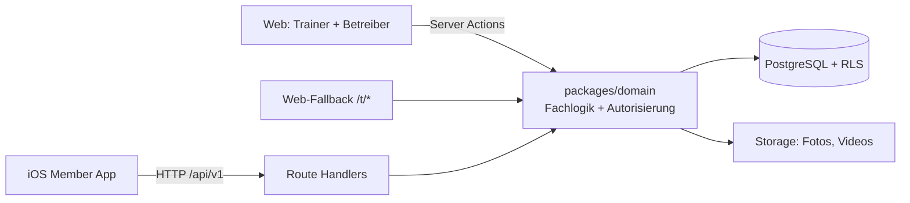

# Fitness Retrofit — Design M1

**Stand:** 28. August 2026
**Status:** abgestimmt, Grundlage für den Implementierungsplan
**Verhältnis zum Blueprint:** Dieses Dokument ist dem `fitness-retrofit-technical-blueprint.md` in Version 1.1 **übergeordnet**, solange es ihm widerspricht. Der Blueprint bleibt als Fernziel und Nachschlagewerk gültig. Abweichungen sind in Abschnitt 12 vollständig aufgeführt.

---

## 1. Warum dieses Dokument existiert

Der Blueprint beschreibt ein MVP für ein Team aus zwei erfahrenen Entwicklern plus Product, UX, Trainerfachexpertise und Datenschutzberatung, mit zugesagten Pilotstudios und einem Horizont von 16–18 Wochen.

Die tatsächlichen Rahmenbedingungen sind andere:

| | Blueprint | Realität |
| --- | --- | --- |
| Team | 2–3 Entwickler + Product/UX | eine Person, KI-gestützt |
| Zeit | Vollzeit | nebenher, kein Termindruck |
| Studios | 2–3 zugesagt | Kontakte, keine Zusage |
| Erstes Ziel | TestFlight-Pilot | etwas, das einen Betreiber überzeugt |

Der Blueprint setzt in Phase 0 als Exit-Kriterium voraus, dass zwei Pilotstudios Prozess und Umfang bestätigen. Das ist nicht erreichbar, solange erst etwas Vorzeigbares existieren muss, um überhaupt fragen zu können. Die gesamte Phasenkette steht damit auf einem Fundament, das es noch nicht gibt.

Dieses Dokument schneidet daraus einen Umfang, der solo und nebenher tatsächlich fertig wird, ohne die Entscheidungen zu beschädigen, die man später nicht mehr korrigieren kann.

---

## 2. Hypothese und Rollen

**Käufer ist der Studiobetreiber. Nutzer ist das Mitglied. Der Trainer ist Inhaltsproduzent, nicht Bediener.**

Das Wertversprechen an den Betreiber lautet nicht „Ihre Trainer betreuen digital", sondern:

> Ihre vorhandenen Geräte bekommen eine digitale Einweisungsebene. Ihre Mitglieder stellen sich selbst korrekt ein, ohne zu fragen, und finden ihre Werte bei jedem Besuch wieder. Sie sehen, was tatsächlich genutzt wird.

Das senkt Personalaufwand, statt ihn zu erhöhen. Das ist der entscheidende Unterschied zur ursprünglichen Blueprint-Konstruktion, in der der Trainer jede Kalibrierung einzeln erfassen musste (bei 80 Mitgliedern und 10 Geräten rund 800 Datensätze pro Studio).

Der zweite Pitchbaustein steht im Blueprint nirgends und ist das stärkste Argument überhaupt: **Retrofit statt Geräteinvestition.** Sensorbasierte Systeme bedeuten eine Investition in neue Geräte. Dieses Produkt klebt auf die Geräte, die bereits dastehen.

### Was eine Demo nicht kann

Ein Betreiber kauft Mitgliederbindung. Bindung lässt sich nicht demonstrieren, sie braucht Monate echter Daten. Vor den Daten überzeugen nur drei Dinge: der Preisvergleich zur Geräteinvestition, der selbst erlebte Tap-Moment auf seinen eigenen Geräten, und ein glaubhaft niedriger Aufwand für sein Personal. Das Betreiber-Dashboard ist deshalb Verkaufsargument, nicht Abschlussfeature — es steht in M2, nicht am Ende.

---

## 3. Meilensteine

Vier Meilensteine mit harten Exit-Kriterien ersetzen die acht Phasen des Blueprints.

### M0 — Physik und Universal Link

Der Blueprint legt Associated Domains, AASA und Universal-Link-Routing in Phase 2 (Woche 4–5). Das ist die falsche Reihenfolge: Hier liegen die beiden Stellen, an denen das Produkt physikalisch scheitern kann, und beide kosten fast nichts zu prüfen.

Die Machbarkeit ist per Recherche geklärt: On-Metal-Tags mit Ferritschicht funktionieren auf Stahlrahmen, Standard-NTAG213 nicht. M0 ist deshalb **kein Erkenntnismeilenstein mehr, sondern ein nativer Verifikationsmeilenstein** — es geht nicht um „ist es möglich", sondern um „funktioniert es mit meiner Hardware, meiner Domain, meinem Gerät".

- On-Metal-Tags beschaffen und auf einem echten Fitnessgerät testen.
- Domain, `apple-app-site-association`, Bundle ID und Associated Domains verdrahten.

**Exit:** Ein Tap auf den Tag am echten Gerät öffnet die (leere) App auf einem echten iPhone. Keine Datenbank, kein Login, kein UI.

Bleibt die Leserate in der Praxis unbrauchbar — falscher Anbringungsort, Tag löst sich, Reichweite zu gering — wird das Produkt QR-first statt NFC-first. Das ist nach zwei Wochenenden entschieden statt nach zwei Monaten.

### M1 — Vertical Slice nativ

Gegenstand dieses Dokuments. Details in Abschnitt 4.

**Exit:** Ein Mitglied tappt am echten Gerät, sieht Einweisung, eigene Einstellwerte und eigene Historie, loggt Sätze und erhält einen Vorschlag. Vollständig auf einem echten iPhone, mit echtem Auth und aktiver RLS.

### M2 — Betreiber-Pitch-Paket

- Betreiber-Dashboard: klein, aber echt
- Gerätekatalog-Pflege komfortabel genug, dass ein Trainer ein Studio ohne Hilfe einrichtet
- Web-Fallback ausgebaut (siehe Abschnitt 6.4)

**Exit:** Ein Studio kann ohne Entwicklerhilfe eingerichtet werden, und der Pitch ist vorführbar.

### M3+ — erst nach Studio-Zusage

Trainingspläne, Trainerfreigaben, Progression Engine im vollen Umfang, DSGVO-Export und Löschung, asynchrone Jobs, Härtung, externes Security-Review, TestFlight-Pilot.

### Der Scope-Cut, der das trägt

**Bis einschließlich M2 gelangen keine echten Personendaten ins System.** Nur synthetische Testdaten und die Konten des Entwicklers. Damit sind DSGVO-Vollausbau, Löschmatrix, Aufbewahrungsfristen, externes Security-Review und Lasttests legitime Voraussetzungen für M3 statt für M1.

### Zwangsfunktion

Ein Solo-Projekt ohne externen Termin scheitert nicht an Überziehung, sondern daran, dass es liegen bleibt. Es wird deshalb ein selbst gesetztes Datum für den ersten Betreibertermin festgelegt und eingehalten, unabhängig vom Fertigstellungsgrad.

---

## 4. Scope M1

### 4.1 Enthalten

1. Studio, Rollen und Mitgliedschaften (ein Studio genügt)
2. Gerätekatalog: Gerätemodelle, Einstellparameter, Übungen, Geräteinstanzen
3. Einweisungsinhalte: ein Foto je Gerätemodell, Videos je Übung
4. NFC-/QR-Tags erzeugen, zuweisen, sperren
5. Universal-Link-Einstieg vom Tag in die native App
6. Übungsauswahl am Gerät, mit Vorauswahl
7. Selbstkalibrierung durch das Mitglied, optional trainerbegleitet
8. Satz-Logging mit minimalen Interaktionen, Resttimer
9. Eigene Historie je Gerät und Übung
10. Session mit Blockstruktur, die Sätze am Stück und Zirkeltraining gleichermaßen trägt
11. Home mit Trainingsverlauf, Session-Detail und Gewichtsverlauf je Übung
12. Deterministischer Progressionsvorschlag aus der Historie
13. Problemmeldung ohne Freitext
14. Web-Fallback in Grundform: Gerätename, Foto, Einweisungsvideo, Installationshinweis. Ausbau (Studio-Branding, Übungsliste, Formatfrage aus 6.8) in M2.

### 4.2 Nicht enthalten

Trainingspläne, Planversionierung, Trainerfreigaben, Trainer-Mitglied-Zuordnung, globaler Gerätekatalog über Studiogrenzen hinweg, Trainerhinweise, Push-Benachrichtigungen, asynchrone Jobs und Worker, Betreiber-Dashboard (M2), DSGVO-Selbstbedienung (M3), Android, Abrechnung, jede Form von Sensorik.

### 4.3 Produktgrenze

Unverändert aus Blueprint §2.3, und sie gilt uneingeschränkt:

> Ohne Sensorik kennt die Plattform nur Daten, die das Mitglied bestätigt. Sie darf nicht behaupten, die tatsächliche Ausführung, das eingestellte Gewicht oder die absolvierten Wiederholungen gemessen zu haben.

Ergänzend: Die Einweisungsinhalte („worauf du achten musst") sind **Inhalte des Studios**, nicht der Plattform. Die Plattform gibt keine Trainings- oder Gesundheitsempfehlungen ab. Das gehört sichtbar in die UI und in den Vertrag — es stützt zugleich die Rollenverteilung aus Blueprint §10.7 (Studio ist Verantwortlicher, Plattform ist Auftragsverarbeiter).

---

## 5. Navigation und Screens

### 5.1 Tab-Struktur

Drei Tabs:

| Tab | Inhalt |
| --- | --- |
| **Home** | Letzte Trainings, Statistik, Übungsfortschritt. Einstieg ohne laufende Session. |
| **Training** | Die aktuelle Session. Herzstück der App. |
| **Profil** | Standardeinstellungen, Datenschutz, Abmelden |

**Reserviert, nicht gebaut:** ein vierter Tab **Plan** (mit M3) und ein fünfter Tab **Kurse**. Die Navigationsstruktur wird so angelegt, dass beide ohne Umbau ergänzt werden können.

**Der Geräte-Screen ist kein Tab.** Er wird immer im Training-Tab geöffnet — unabhängig vom Einstieg: Universal Link bei geschlossener App, NFC-Tap bei offener App, QR-Scan, oder Tap auf einen Block in der laufenden Session. Ein Ort für alles, was am Gerät passiert.

**Scan-Zugang:** ein Button im Training-Tab. Kein Scan-Element in der Tab-Leiste. Der NFC-Tap von außen funktioniert ohnehin unabhängig davon, auch bei geschlossener App.

Vollständige Screenliste M1: Login · Home · Session-Detail · Übungsfortschritt · Training · Gerät · Session-Abschluss · Profil.

Gegenüber Blueprint §9.1 entfallen `Workout` als eigener Screen (geht im Geräte-Screen auf) und `TodayPlan` (kein Plan in M1).

### 5.2 Session-Lebenszyklus

**Start: automatisch beim ersten gescannten Gerät.** Es gibt keinen Startknopf — der Training-Tab füllt sich einfach.

**Ende: explizit** über „Training beenden" im Training-Tab.

**Vergessenes Beenden** ist der Regelfall, nicht der Ausnahmefall. Eine Session ohne neuen Satz seit vier Stunden gilt als beendet. Das wird **träge ausgewertet**, nicht per Cronjob: beim nächsten Lesezugriff wird sie als abgeschlossen behandelt und mit `completed_reason = auto` markiert. Damit bleibt die Regel „kein Async in M1" (6.7) unangetastet und es entsteht kein Datenmüll.

### 5.3 Der Training-Tab: beide Trainingsstile ohne Annahme

Die Session ist eine Liste von **Blöcken**. Ein Block ist ein Gerät plus eine Übung und sammelt seine Sätze.

```
┌──────────────────────────────────┐
│  Training läuft · 00:23          │
│                                  │
│  Beinpresse · Beidbeinig         │
│  3 Sätze · 80 kg            ›    │
│                                  │
│  Latzug · Breiter Griff          │
│  1 Satz · 45 kg             ›    │
│                                  │
│  Beinbeuger                      │
│  1 Satz · 35 kg             ›    │
│                                  │
│  [  Gerät scannen  ]             │
│  [  Training beenden  ]          │
└──────────────────────────────────┘
```

**Ein Tap auf einen Block öffnet den Geräte-Screen für genau dieses Gerät und diese Übung, bereit für den nächsten Satz.** Ohne erneutes Scannen.

Damit sind beide realen Trainingsstile abgedeckt, ohne dass die App sich auf einen festlegt:

- **Sätze am Stück** (2–3 Sätze pro Gerät, dann weiter): Nach dem Satz läuft der Resttimer, die Hauptaktion heißt „Satz 2" mit vorbelegtem Gewicht. Der Nutzer bleibt stehen. Der Training-Tab wird nie gebraucht.
- **Zirkel** (ein Satz je Gerät, dann zweiter Durchgang): Nach dem Satz weitergehen und das nächste Gerät scannen. Im zweiten Durchgang nicht scannen, sondern Training-Tab → Block antippen. Ein Tap statt eines Scans.

**Ein bereits genutztes Gerät erneut zu scannen öffnet denselben Block.** Es entsteht kein Duplikat.

### 5.4 Geräte-Screen nach einem Satz

```
Resttimer läuft ─────────────

[ Satz 2 · 80 kg ]        ← Hauptaktion, Gewicht vorbelegt
  Gewicht ändern
  Übung wechseln
← Zurück zum Training     ← Ausstieg für Zirkeltrainierende
```

Der Satzzähler zeigt die Nummer innerhalb dieses Blocks in dieser Session.

### 5.5 Home-Tab

- **Kopfzeile:** Trainings diese Woche · Trainings gesamt · letztes Training vor X Tagen
- **Letzte Trainings:** Datum, Dauer, Anzahl Geräte, Anzahl Sätze → Tap öffnet **Session-Detail** mit den Blöcken und Sätzen dieser Einheit
- **Übungsfortschritt:** Liste der trainierten Übungen → Tap öffnet **Übungsfortschritt** mit dem Gewichtsverlauf über die Zeit

Der Gewichtsverlauf wird mit **Swift Charts** umgesetzt, ohne externe Abhängigkeit. Die Daten kommen serverseitig aggregiert über `GET /api/v1/me/progress` (6.3), nicht als Rohsatzliste an den Client.

Bewusst mitgekauft: Diese beiden Detailscreens plus der zusätzliche Endpoint sind der größte Einzelposten in M1, der nicht zur Kernschleife gehört. Die Entscheidung ist getroffen, weil der eigene Fortschritt sowohl Motivation für das Mitglied als auch Vorführmaterial für den Betreibertermin ist.

### 5.6 Der Geräte-Screen ist selbsttragend

Der Tap ist ein **Kalteinstieg**: Das Mitglied tappt ein Gerät, ohne die App an diesem Tag geöffnet zu haben. Zwischen Blueprint §7.1 (Tap → Geräteansicht) und §7.3 (Satz speichern) fehlt der Schritt „Session anlegen" — er ist dort nirgends definiert.

Lösung: Es gibt keinen „Workout starten"-Button. Die Session entsteht implizit beim ersten gespeicherten Satz (siehe Abschnitt 7.2).

### 5.7 Übungsauswahl

Der Tap löst ein **Gerät** auf, das Mitglied macht eine **Übung**. Damit der Auswahlschritt das Geschwindigkeitsversprechen nicht bricht:

1. Gerät hat genau eine Übung → Auswahl wird übersprungen.
2. Mitglied hat Historie an diesem Gerät → zuletzt genutzte Übung ist vorausgewählt, Screen rendert sofort, kleine Umschaltmöglichkeit „andere Übung".
3. Erstkontakt mit einem Mehrfachgerät → Liste in der vom Trainer gepflegten Reihenfolge.

Im Normalfall kostet die Übungsauswahl damit keinen zusätzlichen Tap.

Physisch getrennte Stationen (Kabelzug links/rechts) werden als zwei `machines` mit zwei Tags angelegt. Dafür ist keine zusätzliche Struktur nötig.

### 5.8 Problemmeldung

Blueprint §5.7 macht „Schmerz oder Unwohlsein gemeldet" zur wichtigsten Eingangsgröße der Progression, und §9.5 verlangt, dass Sicherheitsfeedback nicht hinter Menüs versteckt wird — aber weder §9.1 noch §8.2 definieren dafür einen Ort. Diese Lücke wird hier geschlossen: Die Meldung ist ein sichtbares Element direkt auf dem Geräte-Screen, neben der Satzbestätigung.

**Ohne Freitext.** Boolean plus feste Auswahlliste (`schmerz`, `geraet_passt_nicht`, `zu_schwer`, `sonstiges`). Freitext über Schmerzen wären besondere Kategorien personenbezogener Daten nach Art. 9 DSGVO. Ein Feld, das nicht existiert, muss nicht geschützt, exportiert oder gelöscht werden.

### 5.9 UX-Regeln

Aus Blueprint §9.5 unverändert übernommen: eine Hand bedienbar, Touch-Ziele ≥ 44 pt, Dynamic Type, VoiceOver, Reduce Motion, kein Keyboard für den normalen Satzabschluss, sichtbare Loading-/Empty-/Offline-/Fehlerzustände, haptisches Feedback nie als einzige Rückmeldung.

---

## 6. Architektur

### 6.1 Überblick



**Eine Domain-Schicht, zwei Eingänge.** Das Web ruft die Domain-Schicht direkt über Server Actions auf — kein HTTP-Umweg, kein OpenAPI-Eintrag, kein generierter Client. Nur iOS geht über HTTP.

Das entspricht Blueprint §16.1.3, macht aber explizit, was dort mehrdeutig bleibt: **Trainer- und Betreiberfunktionen brauchen keine REST-Endpoints, solange sie nur im Web laufen.** Die naive Lesart von §8.2 kostet solo sehr viel Zeit ohne Gegenwert.

RLS bleibt trotzdem auf jeder Tabelle aktiv — zwei Ebenen wie in Blueprint §3.4, gerade weil hier niemand gegenprüft.

### 6.2 Verworfene Alternative: Direktzugriff aus Swift

PostgREST direkt aus der App (`supabase.from("machines").select()`) spart das Schreiben von Endpoints, macht RLS aber zur einzigen Verteidigungslinie. Policy-Fehler sind genau der Fehler, den ein Alleinbauer ohne Review macht. Zusätzlich wanderte Fachlogik in den Client und müsste im Web ein zweites Mal existieren. Blueprint §16.3.7 verbietet das zu Recht; die Entscheidung bleibt bestehen.

### 6.3 API: screenorientiert, nicht ressourcenorientiert

Blueprint §8.2 impliziert ressourcenorientiertes REST. Damit holt die App Gerät, dann Kalibrierung, dann Historie einzeln — mehrere Roundtrips für einen Screen, was das eigene Performancebudget aus §12.1 reißt.

Stattdessen liefert jeder Endpoint genau das, was ein Screen rendert:

```text
GET  /api/v1/tags/{token}/context
     → Gerät, Übungsliste mit Vorauswahl, Einstellparameter,
       signierte Medien-URLs, eigene Kalibrierung, eigene Historie, Vorschlag

GET  /api/v1/me/bootstrap
     → alle Geräte des Studios inkl. token_hash, Übungen,
       eigene Kalibrierungen, letzte Werte

GET  /api/v1/me/sessions
     → Verlauf für den Home-Tab, inkl. Session-Detail

GET  /api/v1/me/progress
     → serverseitig aggregierter Gewichtsverlauf je Übung

PUT  /api/v1/workout-sessions/{sessionId}/sets/{setId}
POST /api/v1/workout-sessions/{sessionId}/complete
```

Sechs Endpoints für die gesamte Member-App.

`GET /me/progress` liefert Aggregate je Übung und Datum, keine Rohsatzliste. Damit bleibt die Nutzlast auch nach einem Jahr Training klein und die Auswertungslogik serverseitig (§16.1).

**`sessionId` und `setId` werden vom Client als UUID erzeugt, der Schreibvorgang ist ein `PUT`.** Damit entfällt `POST /workout-sessions` aus Blueprint §8.2, der Kalteinstieg aus 5.1 löst sich auf, und Idempotenz (§5.6, §16.7.2) ist **strukturell** statt ein Zusatzmechanismus: derselbe `PUT` zweimal gesendet ergibt denselben Satz. Die Tabelle `idempotency_keys` aus §6.1 entfällt ersatzlos.

Die Problemmeldung braucht keinen eigenen Endpoint — sie ist ein Feld im Satz-`PUT`.

Fehlerformat, Fehlercodes, Cursor-Pagination und Versionierung unter `/api/v1` wie in Blueprint §8.1 und §8.3.

### 6.4 Web-Fallback: mehr als eine Hinweisseite

Blueprint §4.1 beschreibt den Fallback als „schlanke Web-Fallback-Seite mit App-Store-Hinweis". Mit dem Modell aus Abschnitt 2 verdient er mehr.

Einweisungsfoto und -video sind **generischer Studio-Content, keine Personendaten**. §5.3 verbietet nur persönliche Trainingsdaten im Fallback. Damit wird aus einer Sackgasse ein Funnel:

> Tap ohne App → sofort nützlich: „So stellst du dieses Gerät ein", Video läuft. Darunter: „App installieren, um deine Einstellungen und deinen Verlauf zu speichern."

Der Nutzen kommt vor der Installationsaufforderung. **Und es funktioniert auf Android.** Damit existiert eine ehrliche Antwort auf die Betreiberfrage nach Android-Mitgliedern: Einweisung für alle, Personalisierung zunächst für iPhone.

### 6.5 Der Install-Bruch

Blueprint §5.3 sichert zu, dass ein Tag-Link „während eines erforderlichen Logins als sichere Pending Route erhalten" bleibt. Über einen App-Store-Install hinweg gilt das nicht — iOS kennt kein Deferred Deep Linking. Der Token ist nach der Installation verloren.

Das ist technisch nicht lösbar, nur vermeidbar: **Die Installation gehört an den Studioeingang, nicht ans Gerät** — Erstgespräch, Anmeldung, Empfang. Das ist eine Prozessvorgabe für den Pilot und gehört in den Betreiber-Pitch, nicht in die Software. Der Fallback aus 6.4 federt den Rest ab.

### 6.6 Prefetch statt reinem Online-first

Blueprint §9.4 legt „online-first" fest. Das ist riskant: Gerätebereiche liegen häufig im Keller, Studio-WLAN ist oft ein Captive Portal. Der kritische Moment fällt genau dann aus, wenn er gebraucht wird.

`GET /api/v1/me/bootstrap` lädt beim App-Start alle Geräte des Studios, deren Übungen, die eigenen Kalibrierungen und letzten Werte. Bei 50 Geräten sind das wenige Dutzend Kilobyte. Danach funktioniert **jeder** Tap sofort und ohne Empfang.

Das ist kein Offline-Modus und kein Sync-Framework. Die Retry-Queue für Schreibvorgänge bleibt wie in Blueprint §9.4 minimal.

### 6.7 Kein Async in M1

Blueprint §4.1 und §5.9 beschreiben Queue, Worker und Edge Functions. Für diesen Zuschnitt tun sie nichts: keine E-Mails außer Auth, keine Aggregate, keine Trainerhinweise, keine Exporte. **Ein Requestpfad, synchron.** Das ist einer der größten gestrichenen Aufwandsposten. Die Queue kommt mit M2/M3 zurück.

### 6.8 Medien

Aufnahme über das Trainerhandy, Upload über mobiles Safari im Trainerportal. **Kein Transcoding** (Blueprint §2.2). Das funktioniert nur mit harten Formatgrenzen:

- maximal 45 Sekunden, 720p, harte Größenobergrenze
- iPhone nimmt standardmäßig HEVC auf; AVPlayer spielt das für eine iOS-only Member-App direkt ab
- **Bewusst mitgekauft:** Sobald Android oder Desktop-Wiedergabe dazukommt, ist entweder H.264 verpflichtend oder Transcoding nötig. Der Web-Fallback aus 6.4 ist davon betroffen und braucht in M2 eine Entscheidung.
- Private Buckets, kurzlebige signierte URLs (Blueprint §10.5). Videos zeigen Menschen — das sind Personendaten des Trainers.
- Upload braucht Fortschrittsanzeige und Wiederaufnahme nach Abbruch. Studio-WLAN.

**Vollständigkeit wird nicht erzwungen.** Ein Gerät startet mit einer Übung ohne Video und funktioniert trotzdem — dann zeigt der Screen nur Einstellwerte und Historie. Ein Alles-oder-nichts-Setup wird von keinem Studio fertiggestellt.

---

## 7. Datenmodell

14 Tabellen statt der rund 25 aus Blueprint §6.1.

### 7.1 Tabellen

**Mandant und Identität**
```text
studios              id, name, timezone
profiles             id (= auth.users.id), display_name
studio_memberships   studio_id, user_id, role ∈ {owner, trainer, member}
```

**Gerätekatalog**
```text
equipment_models              studio_id, name, manufacturer, photo_path,
                              weight_step_kg, min_weight_kg, max_weight_kg
equipment_setting_definitions equipment_model_id, key, label, kind,
                              min, max, step, unit, sort_order
exercises                     studio_id, name, description,
                              target_reps_min, target_reps_max
equipment_model_exercises     equipment_model_id, exercise_id, sort_order
instruction_assets            equipment_model_exercise_id, kind, storage_path, duration_s
machines                      studio_id, equipment_model_id, label, location_note, status
```

**`equipment_models` und `exercises` sind in M1 studio-scoped, nicht global.** Damit entfällt die gesamte Governance-Frage aus Blueprint §5.2 („wer darf globale Vorlagen ändern"), und der Ablauf entspricht dem des Trainers: „Beinpresse Technogym" einmal anlegen mit Parametern und Übungen, dann zwei Instanzen mit zwei Tags darunterhängen. Der globale Katalog kommt per Expand-and-Contract, wenn das zweite Studio dazukommt.

**Das Einweisungsvideo hängt an der Übung, nicht am Gerät.** Ein Kabelzug hat ein Foto und zwanzig Videos.

**Tags**
```text
machine_tags   studio_id, machine_id (nullable), token_hash (unique), status, revoked_at
```
`status ∈ {unassigned, active, revoked, replaced}`. Der Token selbst wird nie gespeichert (Blueprint §10.4).

**Kalibrierung**
```text
member_machine_calibrations   studio_id, user_id, machine_id, exercise_id,
                              values jsonb, schema_version,
                              source ∈ {self, trainer_assisted}, recorded_by, created_at
```

JSONB statt der separaten `calibration_values`-Tabelle aus §6.1: Blueprint §6.3 erlaubt das bei vorhandener `schema_version` und serverseitiger Validierung, und es wird nie nach einzelnen Einstellwerten abgefragt. Spart eine Tabelle und einen Join auf dem heißesten Pfad.

Neue Zeile pro Änderung, nie überschreiben (§5.4). Die neueste gewinnt.

**Blueprint §5.4 kehrt sich um:** Die Regel „Ein Mitglied kann eine Einstellung ansehen, aber nicht stillschweigend die trainerfreigegebene Kalibrierung ersetzen" gilt nicht mehr. Das Mitglied ist Eigentümer seiner Werte; `source` hält fest, ob ein Trainer dabei war. Der gesamte Freigabemechanismus entfällt.

**Training**
```text
workout_sessions   id (client-generiert), studio_id, user_id, started_at, completed_at,
                   completed_reason ∈ {manual, auto}
workout_sets       id (client-generiert), studio_id, session_id, machine_id, exercise_id,
                   set_index, weight_kg numeric, reps int, rir numeric?,
                   problem_flag bool, problem_reason?, performed_at
```

**`set_index` ist die laufende Nummer innerhalb des Blocks**, also innerhalb `(session_id, machine_id, exercise_id)` — nicht innerhalb der Session. Nur so funktioniert das Zirkeltraining aus 5.3 ohne Sonderlogik.

**Blöcke brauchen keine eigene Tabelle.** Sie werden aus `workout_sets` abgeleitet: gruppiert nach `(session_id, machine_id, exercise_id)`, sortiert nach dem ersten Satz des Blocks.

**Vorschlag**
```text
progression_suggestions   studio_id, user_id, machine_id, exercise_id,
                          algo_version, inputs jsonb, result, reason_code, created_at
```

### 7.2 `exercise_id` ist nicht optional

Ohne `exercise_id` in Kalibrierung, Sätzen und Vorschlägen wäre die Historie unbrauchbar: „letztes Mal 45 kg × 10" würde Latzug breit und Latzug eng vermischen, und der Progressionsvorschlag wäre falsch. Das hätte im Pilot realen Schaden angerichtet, nicht nur schlechte UX.

### 7.3 In M1 entfallen

`locations`, `trainer_member_assignments`, alle `training_plan_*`, `workout_feedback` (geht in `workout_sets` auf), `trainer_reviews`, `member_flags`, `audit_log`, `outbox_events`, `idempotency_keys`, `data_requests`, `calibration_values`.

### 7.4 Datentypregeln

Unverändert aus Blueprint §6.3: Gewichte als `numeric`, Einheit kanonisch Kilogramm, Zeitpunkte als `timestamptz` in UTC mit Anzeige in Studiozeitzone, Wiederholungen und Positionen als begrenzte Integer, RIR als validierter Dezimalwert, JSONB nur mit `schema_version` und serverseitiger Validierung, keine fachlich relevanten Informationen ausschließlich in Freitext.

### 7.5 Indizes

- jede Foreign-Key-Spalte
- `machine_tags(token_hash)` eindeutig
- `workout_sets(studio_id, user_id, machine_id, exercise_id, performed_at desc)` — der Historienpfad
- `workout_sessions(studio_id, user_id, started_at desc)`
- `member_machine_calibrations(studio_id, user_id, machine_id, exercise_id, created_at desc)`

### 7.6 RLS

RLS ist auf jeder Tabelle aktiv, mit `FORCE ROW LEVEL SECURITY`. Die meisten Tabellen tragen dafür eine eigene `studio_id`-Spalte; `equipment_setting_definitions`, `equipment_model_exercises` und `instruction_assets` haben keine eigene `studio_id` (siehe Tabellenauflistung in 7.1) und erben ihre Mandantenzugehörigkeit stattdessen über einen Fremdschlüssel-Join auf ihre Elterntabelle — die Policies bilden das per `exists (... join ...)` nach.

- **Studio-Sichtbarkeit:** Zeile sichtbar bei Mitgliedschaft im `studio_id`.
- **Personenbezogene Tabellen zusätzlich:** `user_id = auth.uid()`, außer Rolle ist `trainer` oder `owner`.
- **Schreibrechte:** `machines`, `equipment_*`, `exercises`, `instruction_assets`, `machine_tags` nur `trainer`/`owner`. `member_machine_calibrations` und `workout_*` nur eigener `user_id`.

**Bekannte Falle:** Eine Policy auf `studio_memberships`, die `studio_memberships` abfragt, bricht mit Rekursion ab. Standardlösung ist eine `SECURITY DEFINER`-Funktion, die Mitgliedschaften unter Umgehung der RLS liest. Genau dort baut man solo ein Leck — deshalb ist Blueprint §16.5.4 (Positiv-, Negativ- und Cross-Tenant-Test je Policy) für dieses Projekt nicht verhandelbar.

---

## 8. Kernabläufe

### 8.1 Tap bis gespeicherter Satz

```text
1  Tag (NDEF/QR)  →  https://app.beispiel.de/t/<22-Zeichen-Token>
2  iOS Universal Link → App. App prüft Domain, Pfad, Tokenformat.
                        Sie leitet daraus KEINE Berechtigung ab. (§16.3.9)
3  App hasht den Token lokal (SHA-256), schlägt ihn im Prefetch-Cache nach
   →  Screen rendert sofort, auch ohne Empfang.
4  Parallel: GET /api/v1/tags/{token}/context  (Bearer)
   Server hasht, löst aktiven Tag auf, prüft Mitgliedschaft,
   liefert Gerät + Übungen + Einstellparameter + signierte Medien-URLs
          + eigene Kalibrierung + eigene Historie + Vorschlag.
5  Screen aktualisiert sich.
6  Satz: App erzeugt sessionId (einmal pro Training) und setId,
   sendet PUT /api/v1/workout-sessions/{sessionId}/sets/{setId}
7  Server validiert Werte gegen Einstellparameter und Gewichtsschritte,
   schreibt, gibt den kanonischen Satz zurück.
8  POST /api/v1/workout-sessions/{sessionId}/complete
```

**Schritt 3 löst das Empfangsproblem.** Der Prefetch enthält je Gerät den `token_hash`; die App hat den Token aus der URL, hasht ihn selbst und findet das Gerät lokal. Unbedenklich, weil Tag-Tokens laut Blueprint §10.4 öffentliche Locator sind und Hashes keine Tokens verraten.

Rate Limit auf die Tag-Auflösung (§10.4). Der Token darf niemals in Logs, Sentry oder Analytics landen (§10.6).

### 8.2 Studio-Einrichtung durch den Trainer

1. Gerätemodell anlegen: Name, Hersteller, Foto, Gewichtsschritte
2. Einstellparameter definieren (Sitz, Lehne, Startwinkel …)
3. Übungen anlegen und dem Modell zuordnen, Reihenfolge festlegen
4. Je Übung optional ein Einweisungsvideo aufnehmen und hochladen
5. Geräteinstanzen anlegen und Tags zuweisen

Schritte 4 und 5 sind unabhängig voneinander; ein Gerät ohne Video ist nutzbar.

### 8.3 Erstkontakt eines Mitglieds mit einem Gerät

1. Tap oder Auswahl aus der Geräteliste
2. Übungsauswahl gemäß 5.7
3. Einweisung ansehen (Foto/Video), falls vorhanden
4. Eigene Einstellwerte erfassen — validiert gegen die Einstellparameter
5. Sätze loggen
6. Beim nächsten Besuch: Werte und Historie sind da, Vorschlag erscheint

Ist ein Trainer dabei, ist der Ablauf identisch; gespeichert wird zusätzlich `source = trainer_assisted` und `recorded_by`.

### 8.4 Progressionsvorschlag

Reine Funktion in `packages/domain`, deterministisch, berechnet beim Ausliefern des Gerätekontexts und in derselben Anfrage persistiert. Damit ist Blueprint §16.8.2 erfüllt (Algorithmusversion, Eingaben, Ergebnis, Begründungscode) ohne Queue.

**Woher der Zielwert kommt, wenn es keinen Plan gibt:** Die Übung trägt einen Wiederholungskorridor (`target_reps_min`, `target_reps_max`), den der Trainer beim Anlegen setzt, Vorgabe 8–12. Er ist Studioinhalt, keine persönliche Vorgabe — die Personalisierung entsteht allein aus der Historie. Persönliche Zielkorridore kommen mit den Trainingsplänen in M3.

Regelprinzip aus Blueprint §5.7, reduziert auf die planlose Variante:

1. Problem gemeldet → keine Steigerung
2. Daten unvollständig oder widersprüchlich → keine Steigerung
3. oberes Ende des Korridors mit Reserve erreicht → ein Geräteschritt erhöhen
4. innerhalb des Korridors → Gewicht halten
5. unteres Ende wiederholt verfehlt → ein Geräteschritt reduzieren

Schwellenwerte liegen in versionierter Konfiguration, nicht im UI-Code (§16.8.4). Sie sind in M1 bewusst konservativ und werden vor dem Pilot fachlich geprüft.

---

## 9. Sicherheit und Datenschutz in M1

Es gelten die Baseline-Regeln aus Blueprint §10, mit diesen Präzisierungen:

- **Keine echten Personendaten bis M2 einschließlich.** Nur synthetische Daten und Entwicklerkonten. Das ist die Voraussetzung dafür, DSGVO-Selbstbedienung, Löschmatrix und externes Review nach M3 zu verschieben.
- **Keine Freitextfelder zu Schmerzen, Verletzungen oder Gesundheit** (siehe 5.8). Der billigste Datenschutzgewinn im Projekt.
- Sessions ausschließlich im iOS Keychain, niemals `UserDefaults` oder SwiftData (§9.3, §16.3.8).
- Der Supabase Publishable Key in der App berechtigt ohne Benutzer-Session zu nichts (§10.3).
- Service-Role-Keys niemals im Client oder in normalen Request-Handlern (§16.6.4).
- Private Buckets, signierte URLs, MIME- und Größenprüfung serverseitig anhand des Inhalts, EXIF-Entfernung bei Bildern (§10.5).
- Kein Analytics-SDK, kein Autocapture, keine Werbe-IDs in M1. Produkt-Events werden erst mit M2 eingeführt, dann gegen eine Allowlist.
- Privacy Manifest wird angelegt, sobald die erste externe Abhängigkeit dazukommt, spätestens vor dem ersten TestFlight-Upload.

---

## 10. Regelwerk: was ab Zeile 1 gilt

Blueprint §16 enthält über 100 normative Regeln, geschrieben für ein Team. Sie werden in zwei Klassen geteilt. Kriterium: **Was lässt sich nicht nachrüsten, ohne das Datenmodell zu zerlegen?**

| Ab Zeile 1 verbindlich | Erst ab echtem Nutzer |
| --- | --- |
| `studio_id` und RLS auf jeder Tabelle | vollständiges Privacy Manifest |
| Positiv-, Negativ- und Cross-Tenant-Test je Policy | Löschmatrix und Aufbewahrungsfristen |
| keine Service-Role-Keys im Client | Alerting und SLOs |
| versionierte, vorwärtsgerichtete SQL-Migrationen | Internationalisierung |
| Validierung an jeder Systemgrenze (Zod) | Vier-Augen-Review (solo unmöglich) |
| Idempotenz bei mobilen Writes | vollständige Coverage-Erwartungen |
| Vorschlag und bestätigter Wert getrennt speichern | Cross-Browser-Matrix |
| Historie nie durch stilles Update zerstören | externes Security-Review |
| Gewichte als `numeric`, nie Float | Lasttests |
| Fachlogik serverseitig, nicht im Client | Runbooks |
| generierter OpenAPI-Client, nicht handgepflegt | |
| Sessions nur im Keychain | |

Die linke Spalte ist nicht verhandelbar. Die rechte wird bewusst vertagt und in M3 nachgeholt.

**§16.15.3 (Vier-Augen-Review für Security-, RLS-, Auth-Änderungen) ist solo nicht erfüllbar.** Ersatz: automatisierte Negativtests je Policy als Merge-Blocker, plus ein externes Review vor dem ersten echten Mitglied. Das ist schlechter als vier Augen und wird hier ausdrücklich als Restrisiko festgehalten.

---

## 11. Tests in M1

Risikobasiert, nicht nach Coverage-Prozent.

- **Vollständige Pfadabdeckung:** RLS-Policies, Autorisierung, Progressionsregeln, Validierung der Einstellwerte gegen Parameterdefinitionen.
- **pgTAP/Integration gegen echten Postgres:** jede Policy positiv, negativ und cross-tenant. Mocks ersetzen das nicht (§16.13.8).
- **Swift Testing:** Deep-Link-Parsing, Token-Hashing, Prefetch-Lookup, API-Mapping, Retry.
- **XCUITest:** Login, Tap → Gerät, Satz loggen, Abschluss, Fehlerzustände.
- **Physisch auf echtem iPhone:** NFC, QR, Universal Link, Auth-Callback. Simulator genügt nicht (§16.13.6).
- **Idempotenz:** derselbe `PUT` mehrfach erzeugt genau einen Satz.
- **Blockbildung:** Zirkelfolge (Gerät A, B, C, dann wieder A) erzeugt drei Blöcke mit korrekten `set_index`-Werten, nicht sechs. Erneutes Scannen eines genutzten Geräts öffnet denselben Block.
- **Session-Autoabschluss:** eine Session ohne Satz seit über vier Stunden wird beim nächsten Lesezugriff als `auto` abgeschlossen ausgewiesen.

---

## 12. Abweichungen vom Blueprint

| # | Blueprint | Hier | Grund |
| --- | --- | --- | --- |
| 1 | Phasen 0–8, Team, 16–18 Wochen | M0–M3, solo, ohne Termin | Rahmenbedingungen |
| 2 | AASA/Universal Links in Phase 2 | in M0, zuerst | größtes physikalisches Risiko, billigste Prüfung |
| 3 | Trainingspläne im MVP (§5.5) | nach M3 | teuerster und meinungsstärkster Teil, für die Hypothese nicht nötig |
| 4 | Trainer kalibriert, Mitglied liest (§5.4) | Mitglied kalibriert selbst, Trainer optional | löst den 800-Datensätze-Flaschenhals; verbessert den Pitch |
| 5 | Medien am Gerätemodell | Videos an der Übung | ein Kabelzug hat ein Foto und zwanzig Videos |
| 6 | globaler Gerätekatalog (§5.2) | studio-scoped in M1 | entfernt die Governance-Frage komplett |
| 7 | `calibration_values` als Tabelle | JSONB mit `schema_version` | nie nach Einzelwerten abgefragt; §6.3 erlaubt es |
| 8 | `idempotency_keys` + `client_event_id` | clientgenerierte UUID + `PUT` | Idempotenz strukturell statt als Mechanismus |
| 9 | ressourcenorientiertes REST (§8.2) | screenorientiertes BFF, 5 Endpoints | Roundtrips, Performancebudget, Solo-Aufwand |
| 10 | Trainerfunktionen über REST | Web direkt über Server Actions | halbiert die Vertragsfläche |
| 11 | online-first (§9.4) | Prefetch aller Geräte beim Start | Keller, Captive Portal |
| 12 | Queue, Worker, Edge Functions | kein Async in M1 | tut in diesem Zuschnitt nichts |
| 13 | Web-Fallback als Hinweisseite (§4.1) | Fallback mit Einweisungsinhalten | repariert den Funnel, deckt Android ab |
| 14 | Schmerzfeedback ohne definierten Ort | Element auf dem Geräte-Screen, ohne Freitext | schließt einen Widerspruch; vermeidet Art.-9-Daten |
| 15 | Session explizit starten | implizit beim ersten Satz | schließt die Lücke zwischen §7.1 und §7.3 |
| 16 | §16 vollständig ab Tag 1 | zweigeteilt nach Nachrüstbarkeit | 100+ Regeln sind solo Zeremonie statt Schutz |
| 17 | flache Screenliste (§9.1) | Tab-Navigation Home/Training/Profil | Zirkeltraining braucht einen Ort für die laufende Session |
| 18 | `Progress` nicht näher bestimmt | Gewichtsverlauf je Übung in M1 | Motivation für das Mitglied, Vorführmaterial für den Betreiber |

---

## 13. Offene Entscheidungen

Blockieren M1 nicht, müssen aber vor M2 beziehungsweise vor dem Pitch entschieden sein:

1. **Preismodell.** Der Blueprint enthält keines, obwohl die Kernhypothese „zahlen Studios dafür" lautet. Vor dem ersten Betreibertermin nötig: Preisgröße, Bezugsgröße (pro Gerät, pro Mitglied, Flatrate) und der Vergleich zur Geräteinvestition sensorbasierter Systeme.
2. **Wer beschafft und programmiert die NFC-Tags physisch**, und was kostet ein Tag inklusive Nachbestellung.
3. **Videoformat für den Web-Fallback** — HEVC funktioniert auf iOS, nicht überall im Browser (siehe 6.8).
4. **Konservative Schwellenwerte der Progression**, fachlich geprüft.
5. **Haftungs- und Vertragsrahmen** für Einweisungsinhalte mit Sicherheitsbezug.
6. **iOS-Mindestversion** nach Geräteanalyse der Zielstudios.
7. **Termin für den ersten Betreibertermin** (Zwangsfunktion, Abschnitt 3).

---

## 14. Wesentliche Risiken

| Risiko | Gegenmaßnahme |
| --- | --- |
| Projekt bleibt liegen (Solo, kein Termin) | selbst gesetzter Betreibertermin, M0 als billiger Frühtest |
| NFC liest auf Metall nicht zuverlässig | M0 vor allem anderen; Ausweichpfad QR-first |
| Cross-Tenant-Leck durch `SECURITY DEFINER` | Negativtests je Policy als Merge-Blocker, externes Review vor echtem Nutzer |
| Studio richtet den Katalog nie fertig ein | Vollständigkeit nicht erzwingen; Gerät ohne Video nutzbar |
| Betreiber fragt nach Android-Mitgliedern | Web-Fallback mit Einweisung deckt alle ab; Personalisierung iPhone-only, offen benannt |
| Install-Moment am Gerät verliert das Mitglied | Installation am Studioeingang, Prozessvorgabe im Pitch |
| Zwei Codebasen verdoppeln jedes Feature | Feature-Zahl klein halten; Web ohne HTTP-Vertragsfläche |
| Progression wird als medizinische Empfehlung gelesen | konservative Regeln, Produktgrenze in der UI, Inhalte gehören dem Studio |
| Kein Empfang im Gerätebereich | Prefetch beim App-Start |

---

## 15. Nächster Schritt

Implementierungsplan für **M0** schreiben und abarbeiten, bevor an M1 gebaut wird. M0 ist bewusst so klein, dass es an einem Wochenende scheitern oder gelingen kann — und es entscheidet, ob das Produkt NFC-first oder QR-first wird.
