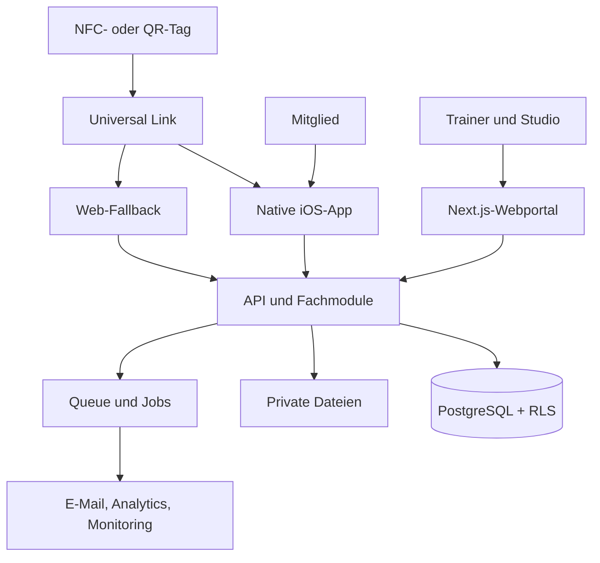
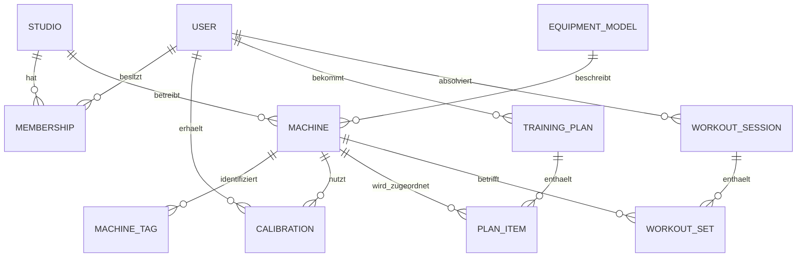

# Fitness Retrofit Platform

## Technischer Blueprint, Umsetzungsplan und verbindliches Programmierregelwerk

**Version:** 1.1  
**Stand:** 17. August 2026  
**Status:** Empfohlene Ausgangsarchitektur für MVP und Pilot  
**Zielgruppe:** Product Owner, Entwickler, UX, DevOps, Datenschutz und externe Umsetzungspartner

---

## 1. Executive Decision

Die Plattform wird mit einer **nativen iOS-App für Mitglieder** und einem **webbasierten Portal für Trainer und Studios** umgesetzt. Jedes Fitnessgerät erhält einen kombinierten NFC-/QR-Tag mit einer anonymen, dynamischen HTTPS-URL. Auf einem iPhone mit installierter App führt diese URL nach der vorgesehenen iOS-Systeminteraktion per Universal Link direkt zum erkannten Gerät in der Member-App. Ohne installierte App erscheint eine schlanke Web-Fallback-Seite mit App-Store-Hinweis und generischen, freigegebenen Geräteinformationen.

Die empfohlene Architektur ist ein **modularer Monolith**:

- eine native iOS-App in Swift und SwiftUI ausschließlich für Mitglieder,
- ein Next.js-Webportal für Trainer und Studioadministration,
- eine kleine öffentliche Web-Fallback-Seite für Tag-Auflösung und App-Installation,
- eine klar abgegrenzte serverseitige API-Schicht,
- PostgreSQL als führendes System,
- Row Level Security als zusätzliche Mandantenschutzschicht,
- asynchrone Jobs über eine Postgres-native Queue,
- Betrieb der produktiven Daten und Rechenfunktionen in Frankfurt.

Microservices, Android und KI-basierte Trainingssteuerung werden bewusst nicht im MVP gebaut. Die iOS-App soll die Kernhypothese mit einem hochwertigen, kontrollierten Member-Erlebnis testen: **Nutzen iPhone-Mitglieder die persönliche Einstellungs- und Trainingshilfe wiederholt, und bezahlen Studios dafür?** Der Pilot muss deshalb ausdrücklich als iPhone-Pilot rekrutiert und ausgewertet werden.

### Verbindliche Technologieentscheidung für das MVP

| Schicht | Entscheidung |
| --- | --- |
| Sprachen | Swift im Strict-Concurrency-Modus für iOS; TypeScript im Strict Mode für Web und Server |
| Member-Client | Native iOS-App mit SwiftUI, Observation und Swift Concurrency |
| Trainer/Studio-Frontend | Next.js App Router und React |
| UI | SwiftUI mit Apple Human Interface Guidelines; Web mit Tailwind CSS, zugänglichen Headless-Komponenten und gemeinsamen Design Tokens |
| Server/API | Next.js Route Handlers als Backend-for-Frontend und versionierte REST-API |
| Datenbank | Supabase-managed PostgreSQL in `eu-central-1` |
| Authentifizierung | Supabase Auth; E-Mail-OTP/Magic Link in iOS, MFA für Mitarbeiter im Web |
| Autorisierung | API-Berechtigungen plus PostgreSQL Row Level Security |
| Dateiablage | Supabase Storage, private Buckets, signierte URLs |
| Hintergrundjobs | Supabase Queues/`pgmq` plus serverseitige Worker/Edge Functions |
| Hosting | Vercel, Functions in `fra1`; Datenbank in Frankfurt |
| Validierung | Zod an jeder Systemgrenze |
| API-Vertrag | REST/JSON, OpenAPI 3.1 als dokumentierter Vertrag |
| iOS-API-Client | Apple Swift OpenAPI Generator plus `URLSession` |
| Lokale iOS-Daten | Keychain für Sessions; SwiftData nur für minimale Cache- und Retry-Daten |
| Tests | Swift Testing/XCTest/XCUITest für iOS; Vitest, Testing Library, Playwright und pgTAP für Web/Backend |
| Produktanalyse | eigenes fachliches Eventmodell; optional PostHog Cloud EU ohne Autocapture |
| Fehleranalyse | Sentry in deutscher/europäischer Region, konsequentes PII-Scrubbing |
| Repository | ein Monorepo mit Xcode-Projekt sowie pnpm-/Turborepo-Workspace |
| CI/CD | macOS-Runner für iOS und Standardrunner für Web/Backend; TestFlight für Pilot-Builds |

Versionsnummern werden nicht dauerhaft in diesem Dokument festgeschrieben. Bei Projektstart wird jeweils die aktuelle stabile beziehungsweise aktive LTS-Version gewählt, im Lockfile fixiert und kontrolliert aktualisiert.

### Bewusst verworfene Alternativen

| Alternative | Entscheidung für das MVP |
| --- | --- |
| Member-PWA als Hauptclient | Nicht einsetzen. Die Member Experience wird nativ für iOS gebaut; das Web dient hier nur als Fallback und Installationsweg. |
| Flutter oder React Native | Nicht einsetzen. Da im MVP ausschließlich iOS bedient wird, liefert SwiftUI das sauberste Apple-native Verhalten ohne plattformübergreifende Abstraktionsschicht. |
| Android-App | Nicht im MVP. Vor einem kommerziellen Rollout wird anhand der Mitgliederstruktur entschieden, wann Android zwingend nachgezogen werden muss. |
| Firebase/Firestore | Nicht führend einsetzen. Das Domänenmodell ist relational, benötigt Historie, Transaktionen, Auswertbarkeit und transparente Mandantenregeln; PostgreSQL passt besser. |
| Separates NestJS-/Fastify-Backend | Im MVP unnötiger Deployment- und Betriebsaufwand. Die API-Verträge bleiben dennoch frameworkunabhängig, damit eine spätere Extraktion möglich ist. |
| Microservices/Kubernetes | Vor gemessenen Skalierungs- oder Teamgrenzen nicht gerechtfertigt. |
| Reines No-Code-Backend | Für einen UX-Prototyp möglich, aber nicht als produktive Basis für Mandantentrennung, sensible Daten und versionierte Trainingslogik. |
| Vollständiger AWS-Eigenbetrieb | Bietet mehr Kontrolle, verursacht aber deutlich mehr Plattformarbeit. Vor Enterprise-Verträgen wird geprüft, ob Vertrags-, Compliance- oder Skalierungsanforderungen einen Wechsel rechtfertigen. |

---

## 2. Scope und Annahmen

### 2.1 Im MVP enthalten

1. Studios, Standorte, Benutzer und Rollen verwalten.
2. Gerätemodelle und konkrete Geräteinstanzen anlegen.
3. NFC-/QR-Tags erzeugen, zuweisen, sperren und neu zuweisen.
4. Trainer können persönliche Geräteeinstellungen kalibrieren.
5. Trainer können Trainingspläne erstellen und freigeben.
6. Mitglieder öffnen über den Tag direkt das erkannte Gerät.
7. Die App zeigt Einstellung, Gewicht, Sätze, Wiederholungen und Anleitung.
8. Mitglieder dokumentieren Sätze mit minimalen Interaktionen.
9. Eine deterministische Regelengine schlägt die nächste Belastung vor.
10. Trainer können Vorschläge prüfen, überschreiben und bei Problemen eingreifen.
11. Studios erhalten Aktivierungs-, Nutzungs- und Engagement-Kennzahlen.
12. Datenschutzfunktionen für Auskunft, Export, Löschung und Aufbewahrung werden vorbereitet.

### 2.2 Nicht im MVP enthalten

- automatische Erkennung von Gewicht, Wiederholungen, Bewegungsumfang oder Technik,
- elektrische oder mechanische Verbindung mit dem Fitnessgerät,
- native Android-App und vollständige Member-Web-App,
- vollautomatische KI-Trainingsplanung ohne Trainerfreigabe,
- medizinische Diagnosen, Therapieempfehlungen oder Reha-Positionierung,
- komplexe Abrechnung im Produkt; Pilotkunden werden zunächst manuell fakturiert,
- eigenes Video-Streaming-System,
- Microservices, Kubernetes oder ein Data Warehouse.

### 2.3 Wichtigste Produktgrenze

Ohne Sensorik kennt die Plattform nur Daten, die der Trainer vorgibt oder das Mitglied bestätigt. Sie darf nicht behaupten, die tatsächliche Ausführung, das eingestellte Gewicht oder die absolvierten Wiederholungen automatisch gemessen zu haben.

---

## 3. Architekturprinzipien

1. **Modularer Monolith zuerst.** Fachmodule sind im Code strikt getrennt, werden aber gemeinsam deployt.
2. **Serverseitige Fachlogik.** Autorisierung, Trainingsregeln und sensible Mutationen laufen nicht ausschließlich im Browser.
3. **PostgreSQL ist führend.** Operative Geschäftsdaten haben genau eine Source of Truth.
4. **Mandantenschutz in zwei Ebenen.** API-Prüfung und Row Level Security müssen beide greifen.
5. **Tags sind öffentlich.** Ein Tag-Token ist kein Geheimnis und darf niemals Personendaten enthalten.
6. **Privacy by Design.** Nur erforderliche Daten erfassen; Gesundheits- und Trainingsdaten nicht in Logs oder Analytics kopieren.
7. **Erklärbare Empfehlungen.** Jede Progression ist deterministisch, versioniert und nachvollziehbar.
8. **Native Member Experience.** Mitglieder trainieren in einer fokussierten iOS-App; Trainer- und Studiofunktionen bleiben im Web.
9. **Verträge statt geteilter Clientlogik.** Swift- und TypeScript-Code teilen OpenAPI- und Eventverträge, aber keine UI- oder Fachlogik. Sicherheits- und Progressionslogik bleibt serverseitig.
10. **API-first innerhalb des Monolithen.** iOS und Web greifen über stabile Verträge auf dieselben Domain Services zu, damit später Android und Integrationen ergänzt werden können.
11. **Keine Vorab-Skalierung.** Infrastruktur wird erst bei gemessenen Engpässen aufgeteilt.

---

## 4. Systemarchitektur



### 4.1 Laufzeitkomponenten

#### Native iOS Member App

Die iOS-App enthält ausschließlich Member-Funktionen:

- Einladung, Login und Studiozuordnung,
- heutiger Trainingsplan,
- Universal-Link- und QR-Einstieg zum Gerät,
- persönliche Geräteeinstellung,
- Satzlogging, Resttimer und Workout-Abschluss,
- Verlauf, Fortschritt und Profil/Datenschutz.

Trainer-, Studio- oder Plattformadministration DARF NICHT in die iOS-App eingebaut werden.

#### Webportal für Trainer und Studios

Eine Next.js-Anwendung enthält zwei rollengetrennte Oberflächen:

- **Coach Area:** Onboarding, Kalibrierung, Pläne, Freigaben und Hinweise.
- **Studio Admin:** Standorte, Geräte, Tags, Rollen, Branding und Analytics.

#### Universal-Link-Resolver und Web-Fallback

Die Route `/t/<token>` ist auf derselben HTTPS-Domain für App und Web erreichbar. Die Domain stellt eine gültige `apple-app-site-association`-Datei bereit. Ist die App installiert, öffnet iOS den Link nativ; andernfalls zeigt die Webroute ausschließlich Installationshinweis, Studio-Branding und freigegebene generische Geräteinformationen. Persönliche Trainingsdaten werden im Fallback nicht angezeigt.

#### API/BFF

Die serverseitige Schicht übernimmt:

- Session- und Rollenprüfung,
- Mandantenauflösung,
- Eingabevalidierung,
- fachliche Transaktionen,
- Orchestrierung der Fachmodule,
- Idempotenz bei mobilen Schreibvorgängen,
- Erstellung von Audit- und Domain-Events.

Die API wird von Beginn an unter `/api/v1` versioniert und über OpenAPI beschrieben. Daraus wird zur Build-Zeit ein typisierter Swift-Client generiert. UI-interne Server Actions dürfen im Web genutzt werden, müssen aber dieselben Domain Services und Autorisierungsregeln verwenden. Die iOS-App greift niemals direkt auf Fach-Tabellen zu; die einzige direkte Supabase-Nutzung im Client ist die Authentifizierung mit einem veröffentlichbaren Schlüssel.

#### PostgreSQL

PostgreSQL speichert:

- Identitäten und Studiomitgliedschaften,
- Geräte- und Übungskatalog,
- persönliche Kalibrierungen,
- Trainingspläne und Versionen,
- Workout-Sessions und Sets,
- Vorschläge und Trainerentscheidungen,
- Audit- und Outbox-Events.

#### Storage

Private Buckets speichern Gerätebilder und eigene Anleitungsvideos. Zugriff erfolgt zeitlich begrenzt über signierte URLs. Öffentliche Buckets sind nur für wirklich öffentliche Marken- und Designassets erlaubt.

#### Queue und Worker

Asynchron verarbeitet werden:

- E-Mails und Einladungen,
- Erzeugung von Vorschaubildern,
- Engagement-Aggregate,
- Trainerhinweise,
- Datenexporte und Löschläufe,
- spätere Webhooks zu Drittsystemen.

Der Request, der ein Workout speichert, darf nicht von Analytics oder E-Mail-Versand abhängen.

---

## 5. Fachmodule und Komponentenplan

### 5.1 Identity & Tenancy

**Verantwortung**

- Benutzerkonto und Login,
- Studios und Standorte,
- Rollen und Mitgliedschaften,
- Trainer-Mitglied-Zuordnung,
- Studio-Branding und Zeitzone.

**Rollen im MVP**

| Rolle | Rechte |
| --- | --- |
| Platform Admin | technische Administration; kein standardmäßiger Zugriff auf Trainingsdaten |
| Studio Owner | Vertrag, Standorte, Mitarbeiter und alle Studioeinstellungen |
| Studio Admin | Geräte, Tags, Nutzer und Auswertungen |
| Trainer | zugeordnete Mitglieder, Kalibrierungen und Trainingspläne |
| Member | ausschließlich eigene Einstellungen, Pläne und Workouts |

**Abnahmekriterien**

- Ein Benutzer kann mehreren Studios angehören.
- Rollen gelten immer innerhalb eines Studios.
- Ein Trainer sieht standardmäßig nur zugeordnete Mitglieder.
- Jede mandantenbezogene Tabelle besitzt `studio_id` und aktivierte RLS.
- Mitarbeiterkonten unterstützen verpflichtende MFA.

### 5.2 Equipment Catalog

**Verantwortung**

- globaler Gerätemodellkatalog,
- studiospezifische Geräteinstanzen,
- unterstützte Übungen,
- Einstellungsdefinitionen,
- Gewichtsschritte,
- Anleitungsinhalte und Medien.

Es wird zwischen einem **Gerätemodell** und einer **Geräteinstanz** unterschieden. Zwei identische Modelle in einem Studio sind zwei Instanzen und können unterschiedliche Wartungszustände oder kleine Abweichungen besitzen.

**Abnahmekriterien**

- Ein Modell kann mehrere Einstellparameter besitzen, zum Beispiel Sitz, Lehne und Startwinkel.
- Ein Studio kann globale Vorlagen übernehmen und lokal ergänzen.
- Globale Vorlagen können nur durch Plattformrollen geändert werden.
- Medien besitzen Quelle, Rechteinformation, Version und Freigabestatus.

### 5.3 Tag Registry

**Verantwortung**

- Erzeugung zufälliger Tag-Tokens,
- Zuordnung Tag zu Geräteinstanz,
- Status `unassigned`, `active`, `revoked`, `replaced`,
- Scan-Auflösung und Rate Limiting,
- Nachdruck und Austausch.

**Tagformat**

```text
https://app.example.com/t/<opaque-128-bit-token>
```

QR-Code und NFC-NDEF-Datensatz enthalten exakt dieselbe HTTPS-URL. Es wird keine proprietäre URL-Scheme- oder Web-NFC-Lösung benötigt. Die Domain ist per Associated Domains sicher mit der iOS-App verbunden. Ist die App installiert, öffnet ein Universal Link den passenden Screen; andernfalls übernimmt der Browser den Web-Fallback.

**Abnahmekriterien**

- Tokens sind zufällig, nicht sequenziell und nicht erratbar.
- Tags enthalten keine `studio_id`, `machine_id`, E-Mail oder Mitgliedsnummer im Klartext.
- Ein gesperrter Tag liefert keine Gerätedaten.
- Ein aktiver Tag kann ohne physischen Austausch auf eine andere Geräteinstanz umgebucht werden.
- Nicht eingeloggte Nutzer sehen maximal generische, vom Studio freigegebene Geräteinformationen.
- Die `apple-app-site-association`-Datei ist automatisiert erreichbar und Bestandteil der Deployment-Smoke-Tests.
- Ein eingehender Tag-Link bleibt während eines erforderlichen Logins als sichere Pending Route erhalten und wird danach fortgesetzt.

### 5.4 Member Calibration

**Verantwortung**

- persönliche Gerätepositionen,
- Ausgangslast,
- Trainer, Zeitpunkt und Freigabestatus,
- Kalibrierhistorie.

Einstellwerte werden gegen die Definition des Gerätemodells validiert. Freitext ist nur als ergänzende Notiz erlaubt und darf keine Diagnosefunktion ersetzen.

**Abnahmekriterien**

- Jede Kalibrierung zeigt, wer sie wann vorgenommen hat.
- Änderungen überschreiben die Historie nicht.
- Ein Mitglied kann eine Einstellung ansehen, aber nicht stillschweigend die trainerfreigegebene Kalibrierung ersetzen.
- Eine persönliche Überschreibung ist möglich, wird jedoch als solche markiert.

### 5.5 Training Plans

**Verantwortung**

- Pläne, Trainingstage und Übungen,
- zugewiesene Geräte,
- Sätze, Wiederholungsbereich und Zielbelastung,
- Planstatus und Versionierung,
- Trainerfreigabe.

Ein aktivierter Plan wird nicht rückwirkend verändert. Strukturänderungen erzeugen eine neue Version. Jede absolvierte Einheit speichert zusätzlich einen Snapshot der damaligen Vorgabe.

### 5.6 Workout Capture

**Verantwortung**

- Workout-Session starten und beenden,
- tatsächliche oder bestätigte Sätze speichern,
- Wiederholungen, Last und Belastungsempfinden,
- kurzlebige lokale Retry-Warteschlange in SwiftData und serverseitige Idempotenz,
- Abbruch- und Schmerzfeedback.

**Abnahmekriterien**

- Ein normaler Satz lässt sich mit höchstens zwei Interaktionen bestätigen.
- Doppelte Requests erzeugen keinen doppelten Satz.
- Jeder Client-Write besitzt eine `client_event_id` oder einen Idempotency-Key.
- Vorgabe und tatsächlich bestätigter Wert werden getrennt gespeichert.
- Ein bei kurzfristigem Verbindungsverlust bestätigter Satz wird später synchronisiert und sichtbar als synchronisiert markiert.

### 5.7 Progression Engine

**Verantwortung**

- deterministische Auswertung der letzten Einheiten,
- Vorschlag `increase`, `hold`, `decrease`, `trainer_review`,
- Berücksichtigung des kleinsten Gewichtsschrittes,
- Trainerfreigabe und Begründung,
- Algorithmusversion und Audit Trail.

**MVP-Regelprinzip**

1. Schmerz oder Unwohlsein gemeldet → keine Steigerung, Trainerprüfung.
2. Daten unvollständig oder widersprüchlich → keine Steigerung.
3. Alle Zielsätze und Zielwiederholungen mit ausreichender Reserve erreicht → ein Geräteschritt erhöhen.
4. Ziel gerade erreicht → Gewicht halten.
5. Ziel wiederholt verfehlt → ein Geräteschritt reduzieren oder Trainerprüfung.

Die konkreten Schwellenwerte werden mit einem qualifizierten Trainer fachlich definiert und als versionierte Konfiguration gespeichert. Sie dürfen nicht über UI-Code verteilt werden.

### 5.8 Engagement & Retention

**Verantwortung**

- Aktivierung nach Onboarding,
- Anzahl aktiver Trainingstage,
- Planerfüllung,
- Zeit seit letzter Aktivität,
- Trainerhinweise für nachlassende Nutzung.

Scans sind nur ein Nutzungssignal und kein Beweis für eine absolvierte Übung. Dashboards müssen zwischen `tag_scanned`, `machine_viewed`, `set_logged` und `workout_completed` unterscheiden.

### 5.9 Notifications

Im MVP werden nur transaktionale und fachlich begründete Nachrichten versendet:

- Einladung und Login,
- Plan wurde freigegeben,
- Trainer hat eine Änderung vorgenommen,
- Trainerhinweis bei vom Mitglied gemeldetem Problem.

Marketingkommunikation bleibt technisch und rechtlich getrennt.

### 5.10 Privacy & Audit

**Verantwortung**

- nachvollziehbare Änderungen sensibler Daten,
- Auskunft und Export,
- Lösch- beziehungsweise Anonymisierungsworkflow,
- Einwilligungs- und Informationsversionen, falls rechtlich erforderlich,
- Zugriffshistorie für administrative Sonderzugriffe.

---

## 6. Empfohlenes Datenmodell

### 6.0 Vereinfachte Beziehungen



### 6.1 Kerntabellen

| Bereich | Tabellen |
| --- | --- |
| Mandanten | `studios`, `locations`, `studio_memberships`, `trainer_member_assignments` |
| Benutzer | `profiles`, Verweis auf Auth-User |
| Geräte | `equipment_models`, `equipment_setting_definitions`, `machines`, `machine_tags` |
| Inhalte | `exercises`, `equipment_model_exercises`, `instruction_assets` |
| Kalibrierung | `member_machine_calibrations`, `calibration_values` |
| Trainingsplanung | `training_plans`, `training_plan_versions`, `training_plan_items` |
| Training | `workout_sessions`, `workout_sets`, `workout_feedback` |
| Steuerung | `progression_suggestions`, `trainer_reviews`, `member_flags` |
| Plattform | `audit_log`, `outbox_events`, `idempotency_keys`, `data_requests` |

### 6.2 Pflichtfelder

Jede fachliche Tabelle besitzt grundsätzlich:

- `id` als UUID,
- `studio_id`, wenn mandantenbezogen,
- `created_at` und `updated_at` als `timestamptz`,
- `created_by`, wenn fachlich relevant,
- eine klar dokumentierte Löschstrategie.

### 6.3 Datentypregeln

- Gewichte als `numeric`, niemals binäre Fließkommazahl.
- Einheit separat und kanonisch; intern im MVP Kilogramm.
- Geldbeträge als Integer in Cent plus ISO-Währung.
- Zeitpunkte immer UTC in `timestamptz`; Anzeige in Studiozeitzone.
- Wiederholungen und Positionen als begrenzte Integerwerte.
- RIR/RPE als validierter Dezimalwert mit festgelegtem Wertebereich.
- Flexible Kalibrierwerte dürfen JSONB nutzen, benötigen aber `schema_version` und serverseitige Validierung.
- Keine fachlich relevanten Informationen ausschließlich in unstrukturiertem Freitext speichern.

### 6.4 Indizes

Mindestens erforderlich:

- jede Foreign-Key-Spalte,
- `(studio_id, id)` beziehungsweise fachlich passende zusammengesetzte Indizes,
- aktive Pläne nach `(studio_id, member_id, status)`,
- Workouts nach `(studio_id, member_id, started_at desc)`,
- Tags eindeutig nach `token_hash`,
- Queue-/Outbox-Events nach Status und Verarbeitungszeitpunkt.

### 6.5 Löschung

Soft Delete ist kein Ersatz für DSGVO-Löschung. Für jedes Datenobjekt wird entschieden:

- physisch löschen,
- rechtlich begründet aufbewahren,
- anonymisieren,
- oder bis zum Ablauf einer dokumentierten Frist sperren.

Diese Matrix muss vor dem Produktivpilot mit Datenschutz und Rechtsberatung festgelegt werden.

---

## 7. Zentrale Abläufe

### 7.1 Tag zu personalisierter Geräteansicht

1. iPhone erkennt die HTTPS-URL `/t/<token>` über NFC oder QR.
2. Bei installierter App übergibt iOS den Universal Link an die Member-App; andernfalls öffnet Safari den Web-Fallback.
3. Die App validiert lediglich das URL-Format und sendet den Token an die API; sie leitet keine Berechtigung aus dem Link ab.
4. Der Server hasht den Token und löst den aktiven Tag auf.
5. Ohne Session startet die App den Login und bewahrt die Pending Route sicher für die anschließende Fortsetzung auf.
6. Mit Session prüft die API Studiomitgliedschaft und Rolle.
7. Die API lädt Geräteinstanz, Kalibrierung und aktiven Planpunkt.
8. Die native App zeigt personalisierte Einstellung und Vorgabe.
9. Der Scan wird als technisches Event erfasst; Training gilt noch nicht als absolviert.

### 7.2 Trainer-Onboarding

1. Trainer wählt ein Mitglied.
2. Trainer erstellt einen Plan aus Vorlage oder manuell.
3. Trainer öffnet jede relevante Geräteinstanz.
4. Persönliche Positionen und Startlast werden gespeichert.
5. Validierung prüft Werte gegen Geräteschema.
6. Trainer aktiviert die Planversion.
7. Mitglied erhält Zugriff und optional eine transaktionale Nachricht.

### 7.3 Satz speichern und Progression vorschlagen

1. Mitglied bestätigt Satz, Last, Wiederholungen und optional RIR.
2. Client sendet eindeutige `client_event_id`.
3. API prüft Session, Studio, aktiven Plan und Eingabewerte.
4. Satz und Outbox-Event werden in einer Transaktion gespeichert.
5. Worker aktualisiert Aggregate und berechnet nach Workout-Abschluss den Vorschlag.
6. Vorschlag enthält Algorithmusversion, Inputs, Ergebnis und Begründungscode.
7. Je nach Regel wird er automatisch für die nächste Anzeige vorgemerkt oder dem Trainer zur Freigabe vorgelegt.

---

## 8. API-Design

### 8.1 Grundregeln

- REST/JSON unter `/api/v1`.
- OpenAPI-Vertrag ist Teil des Repositories.
- Alle Eingaben werden serverseitig mit Zod validiert.
- Fachfehler besitzen stabile Codes und nutzerfreundliche Texte.
- Listen nutzen Cursor-Pagination.
- Mutationen unterstützen Idempotenz, wenn Wiederholung durch Mobilfunk oder Offline-Sync realistisch ist.
- APIs geben keine internen Datenbankfehler aus.
- IDs in Pfaden berechtigen zu nichts; jede Ressource wird zusätzlich autorisiert.

### 8.2 Beispielendpunkte

```text
GET    /api/v1/tags/{token}/context
GET    /api/v1/me/active-plan
GET    /api/v1/machines/{machineId}/member-context
POST   /api/v1/workout-sessions
POST   /api/v1/workout-sessions/{sessionId}/sets
POST   /api/v1/workout-sessions/{sessionId}/complete

POST   /api/v1/coach/members/{memberId}/calibrations
POST   /api/v1/coach/members/{memberId}/plans
POST   /api/v1/coach/plans/{planId}/activate
GET    /api/v1/coach/alerts

POST   /api/v1/admin/machines
POST   /api/v1/admin/tags/{tagId}/assign
POST   /api/v1/admin/tags/{tagId}/revoke
GET    /api/v1/admin/engagement
```

### 8.3 Fehlerformat

```json
{
  "error": {
    "code": "CALIBRATION_VALUE_OUT_OF_RANGE",
    "message": "Die Sitzposition ist für dieses Gerät ungültig.",
    "requestId": "req_...",
    "fieldErrors": {
      "seatPosition": "Erlaubt sind Positionen 1 bis 8."
    }
  }
}
```

---

## 9. Client- und UX-Architektur

### 9.1 Native iOS-App

Die Member-App wird mit SwiftUI aufgebaut. Die Projektstruktur ist featureorientiert:

```text
FitnessMember/
├─ App/                       # Lifecycle, Navigation, Dependency Wiring
├─ Core/
│  ├─ API/                   # generierter OpenAPI-Client und Transport
│  ├─ Auth/                  # Supabase Auth und Keychain Session Storage
│  ├─ DeepLinks/             # Universal-Link-Routing
│  ├─ Persistence/           # minimale SwiftData Retry Queue
│  ├─ Telemetry/             # Allowlist-Events und Fehleradapter
│  └─ DesignSystem/          # Farben, Typografie, Komponenten
└─ Features/
   ├─ Onboarding/
   ├─ TodayPlan/
   ├─ Machine/
   ├─ Workout/
   ├─ Progress/
   └─ ProfilePrivacy/
```

SwiftUI Views bleiben deklarativ und enthalten keine API-, Auth- oder Progressionslogik. Screen-Modelle werden mit Observation aufgebaut und auf dem `MainActor` aktualisiert. Netzwerkzugriffe verwenden Swift Concurrency. Fachliche Empfehlungen werden vom Server geliefert und nicht in Swift dupliziert.

### 9.2 Universal Links, NFC und QR

- Die App registriert `applinks:<domain>` über Associated Domains.
- Die Domain liefert `/.well-known/apple-app-site-association` ohne Redirect und mit korrektem Content-Type aus.
- `/t/*` öffnet in der installierten App den Machine-Flow.
- Ohne App zeigt dieselbe URL einen Installationshinweis und generische Geräteinformationen im Browser.
- Der initiale Tag-Link wird nach Login oder App-Neustart kontrolliert fortgesetzt.
- QR kann über die iOS-Kamera und zusätzlich über einen optionalen Scanner in der App geöffnet werden.
- NFC-Hardware wird im MVP nicht aktiv über Core NFC gelesen; das iPhone nutzt Background Tag Reading für den NDEF-HTTPS-Link.
- Custom URL Schemes sind höchstens als technischer Auth-Fallback erlaubt, nicht für Geräte-Tags.

### 9.3 Authentifizierung und Session

- Studio lädt das Mitglied ein; Selbstregistrierung ohne Studiozuordnung ist im MVP deaktiviert.
- Login erfolgt per E-Mail-OTP oder Magic Link.
- Auth-Callback verwendet bevorzugt einen Universal Link auf der eigenen Domain.
- Supabase Swift wird ausschließlich für Authentifizierung und Session-Lifecycle verwendet.
- Access- und Refresh-Token werden im iOS Keychain gespeichert, niemals in `UserDefaults` oder SwiftData.
- Nach erfolgreichem Login ruft die App ausschließlich die eigene `/api/v1`-Schnittstelle auf.
- Der Server validiert Token, Studiomitgliedschaft und konkrete Ressourcenberechtigung bei jedem Request.

### 9.4 Lokale Daten und Verbindungsausfälle

- Das MVP ist online-first und verspricht keinen vollständigen Offlinebetrieb.
- Der zuletzt geladene Screen darf kurzfristig im Arbeitsspeicher erhalten bleiben.
- Ein noch nicht bestätigter Satz kann bei kurzem Netzausfall als minimaler Pending Write in SwiftData gespeichert werden.
- Pending Writes enthalten `client_event_id`, notwendige technische IDs und Satzwerte, aber keine Freitext- oder Verletzungsangaben.
- Synchronisierung wird beim erneuten Erreichen des Vordergrunds und bei wiederhergestellter Verbindung versucht.
- Nach bestätigter Serverspeicherung wird der lokale Write gelöscht.
- Hintergrundausführung wird nicht als zuverlässiger Sync-Kanal vorausgesetzt.

### 9.5 UX-Regeln im Trainingskontext

- Tag bis personalisierte Ansicht: Zielwert unter zwei Sekunden bei bestehender Session und normalem 4G/WLAN.
- Hauptaktion ist mit einer Hand bedienbar.
- Touch-Ziele entsprechen mindestens Apples Empfehlung von 44 × 44 Punkten.
- Dynamic Type, VoiceOver, ausreichender Kontrast und Reduce Motion werden unterstützt.
- Kein Keyboard für den normalen Satzabschluss.
- Gewichte und Positionen werden groß und eindeutig dargestellt.
- Loading-, Empty-, Offline-, Sync- und Fehlerzustände sind sichtbar.
- Haptisches Feedback bestätigt Satzabschluss, darf aber nicht die einzige Rückmeldung sein.
- Sicherheitsfeedback wie Schmerzen darf nicht hinter Menüs versteckt werden.
- Push-Berechtigung wird erst nach erklärtem Nutzen angefragt; Push-Payloads enthalten keine Trainings- oder Gesundheitsdetails.

### 9.6 Webportal und Web-Fallback

- Trainer- und Studioportal bleiben responsive Webanwendungen.
- Sie teilen Design Tokens und API-Verträge mit dem Gesamtsystem, aber keine iOS-Komponenten.
- Der Web-Fallback ist keine vollwertige Member-App und zeigt keine persönlichen Workouts.
- Der Web-State bleibt komponentennah; Optimistic Updates sind nur mit definiertem Rollback erlaubt.

---

## 10. Sicherheit und Datenschutz

### 10.1 Baseline

OWASP ASVS Level 2 wird als Sicherheitsbaseline verwendet. Vor dem Pilot erfolgt mindestens ein fokussierter externer Security Review der Authentifizierung, Mandantentrennung, Uploads und Tag-Auflösung.

### 10.2 Mandantentrennung

- RLS auf jeder exponierten mandantenbezogenen Tabelle.
- Jede Policy wird automatisiert positiv und negativ getestet.
- Browser und normale Request-Handler verwenden keinen Secret-/Service-Role-Key.
- Erhöhte Schlüssel sind ausschließlich serverseitigen Workern und expliziten Betriebsaufgaben vorbehalten.
- Eine fehlende `studio_id` ist ein Datenmodellfehler und blockiert den Merge.

### 10.3 Zugriff

- Magic Link oder OTP für Mitglieder, um Passwort-Support zu reduzieren.
- Member-Sessions werden in iOS ausschließlich im Keychain gespeichert.
- Der in der App enthaltene Supabase Publishable Key berechtigt ohne Benutzer-Session zu keinen Fach- oder Personendaten.
- MFA für Owner, Admins und Trainer.
- Kurze Sessions für administrative Hochrisikoaktionen beziehungsweise erneute Bestätigung.
- Keine gemeinsam genutzten Trainerkonten.
- Supportzugriff nur als zeitlich begrenzter, protokollierter Break-Glass-Prozess.

### 10.4 Tags

- Token mindestens 128 Bit Zufall.
- In der Datenbank bevorzugt nur Token-Hash speichern.
- Rate Limits für Auflösung und wiederholte Fehlversuche.
- Tag-Token gilt als öffentlicher Locator, nicht als Authentisierung.
- Klonen eines Tags darf keine persönlichen Daten freigeben.

### 10.5 Dateien

- Nur ausdrücklich erlaubte MIME-Typen und Größen.
- Dateityp serverseitig anhand des Inhalts prüfen, nicht nur anhand der Endung.
- EXIF- und Standortmetadaten aus Bildern entfernen.
- Private Buckets und kurzlebige signierte URLs.
- Keine aktiven Dokumentformate oder ausführbaren Uploads im MVP.

### 10.6 Logs und Analytics

Niemals loggen oder an Produktanalyse senden:

- Namen, E-Mail-Adressen oder vollständige Mitgliedsnummern,
- Verletzungen, Diagnosen oder Freitextnotizen,
- komplette Trainingspläne oder konkrete persönliche Leistungswerte,
- Auth-Tokens, Magic Links, Tag-Tokens oder Secret Keys.

Erlaubt sind pseudonyme technische IDs und grobe Produkt-Events, sofern Rechtsgrundlage, Information und Aufbewahrung geklärt sind.

### 10.7 Datenschutzrollen

Arbeitshypothese: Das Studio ist für die Mitgliedsdaten Verantwortlicher, der Plattformanbieter Auftragsverarbeiter. Diese Rollen, der Auftragsverarbeitungsvertrag, Unterauftragnehmer, Datenflüsse und Löschfristen müssen vor dem Produktivpilot juristisch bestätigt werden. Die gewählte Laufzeitregion ersetzt diese vertragliche und rechtliche Prüfung nicht.

Angaben zu Verletzungen, körperlichen Einschränkungen oder Gesundheitszuständen können besondere Kategorien personenbezogener Daten betreffen. Auch Trainings- und Leistungsdaten können je nach Kontext Rückschlüsse auf den Gesundheitszustand zulassen. Solche Daten werden minimiert und im MVP nur nach expliziter rechtlicher und technischer Freigabe erhoben.

### 10.8 iOS- und App-Store-Anforderungen

- Ausschließlich HTTPS-Verbindungen; Ausnahmen von App Transport Security sind verboten.
- Tokens und andere Geheimnisse werden im Keychain gespeichert; `UserDefaults` enthält nur nicht sensitive Präferenzen.
- Persistierte Pending Writes verwenden iOS Data Protection und werden nach erfolgreichem Sync sofort entfernt.
- Beim Wechsel in den Hintergrund wird die App-Vorschau für sensible Screens neutralisiert.
- Push-Payloads enthalten keine Namen, Gewichte, Trainingsdetails oder Gesundheitsangaben.
- Drittanbieter-SDKs benötigen eine fachliche, datenschutzrechtliche und sicherheitstechnische Freigabe.
- Die App enthält ein gepflegtes Privacy Manifest einschließlich Required-Reason-APIs aller eingebundenen SDKs.
- App-Store-Privacy-Angaben müssen sämtliche Datenerhebung der eigenen App und eingebundener Partner korrekt abbilden.
- Advertising Identifier, Cross-App-Tracking und Werbe-SDKs sind im MVP verboten.
- Die App bietet einen direkten Weg zu Datenschutzhinweisen, Datenexport und Löschanfrage.
- Jailbreak-Erkennung oder Client-Obfuskation darf niemals serverseitige Autorisierung ersetzen.

---

## 11. Beobachtbarkeit und Produktanalyse

### 11.1 Drei getrennte Signalarten

| Signal | Zweck | Beispiel |
| --- | --- | --- |
| Technische Logs/Traces | Betrieb und Fehleranalyse | Requestdauer, Fehlercode |
| Fachliche Audit-Events | Nachvollziehbarkeit | Trainer änderte Planversion |
| Produkt-Events | Nutzung und MVP-Hypothese | Gerät geöffnet, Workout abgeschlossen |

Diese Datenarten dürfen nicht ungeprüft in dasselbe System geschrieben werden.

### 11.2 Minimales Eventvokabular

```text
member_invited
member_activated
member_ios_app_activated
universal_link_opened
tag_scanned
machine_context_viewed
calibration_completed
plan_activated
workout_started
set_logged
workout_completed
progression_suggested
trainer_review_completed
```

Jedes Event besitzt eine dokumentierte Definition. Ereignisnamen und Properties werden über ein sprachneutrales JSON-Schema definiert und daraus beziehungsweise daraus abgeleitet in Swift und TypeScript typisiert. Freie Eventnamen aus einzelnen Views sind verboten.

### 11.3 Betriebskennzahlen

- p50/p95 Tag-Auflösungszeit,
- p95 API-Latenz je Endpoint,
- Error Rate und Auth-Fehler,
- Queue-Lag und fehlgeschlagene Jobs,
- Offline-Sync-Fehler,
- Datenbankverbindungen und langsame Queries,
- Verfügbarkeit der kritischen Scan- und Workout-Flows.

---

## 12. Nichtfunktionale Anforderungen

### 12.1 Zielwerte für den Pilot

| Bereich | Ziel |
| --- | --- |
| Verfügbarkeit | 99,5 % pro Monat für kritische Funktionen |
| Tag-Auflösung | p95 unter 1 Sekunde serverseitig |
| Personalisierte Seite | unter 2 Sekunden bei bestehender Session und normaler Verbindung |
| API-Schreibvorgang | p95 unter 500 ms ohne nachgelagerte Jobs |
| iOS Kaltstart | Zielwert unter 2 Sekunden bis zur bedienbaren Startansicht auf unterstützten Pilotgeräten |
| RPO | maximal 1 Stunde; Point-in-Time-Recovery vor dem Produktivpilot aktivieren |
| RTO | maximal 4 Stunden im Pilot |
| iOS | Standardannahme iOS 18 oder neuer; final nach Geräteanalyse der Pilotstudios |
| Geräteprüfung | Universal Link, NFC und QR auf physischen iPhones in allen unterstützten Hauptversionen testen |
| Browser | aktuelle Safari-, Chrome-, Edge- und Firefox-Versionen für Trainer- und Studioportal |
| Barrierefreiheit | iOS mit VoiceOver/Dynamic Type; Webkernflows nach WCAG 2.2 AA |

RPO und RTO müssen vor Produktivstart mit dem gebuchten Infrastrukturplan abgeglichen und dokumentiert werden.

### 12.2 Skalierungsannahme

Das MVP wird für folgende Größenordnung gebaut:

- bis 20 Pilotstudios,
- bis 30.000 registrierte Mitglieder,
- bis 5.000 Geräteinstanzen,
- kurzfristige Peaks am frühen Abend,
- mindestens zehnfache Pilotlast ohne Architekturwechsel.

Es wird horizontal erst skaliert, wenn Messwerte dies rechtfertigen. Tabellen und Indizes müssen dennoch von Beginn an mandantengerecht aufgebaut sein.

---

## 13. Repository-Struktur

```text
/
├─ apps/
│  ├─ ios-member/             # Xcode-Projekt: ausschließlich Member-App
│  │  ├─ FitnessMember/
│  │  ├─ FitnessMemberTests/
│  │  └─ FitnessMemberUITests/
│  └─ web/                    # Next.js: Coach, Studio Admin, API, Web-Fallback
├─ packages/
│  ├─ domain/                 # reine Fachlogik und Regeln
│  ├─ contracts/              # OpenAPI, JSON-Schemas, Zod und Eventverträge
│  ├─ database/               # generierte DB-Typen und Query-Adapter
│  ├─ ui-web/                 # Web-Design-System und zugängliche Komponenten
│  ├─ observability/          # Logs, Traces, Fehler- und Eventadapter
│  └─ config/                 # gemeinsame lint/ts/test-Konfiguration
├─ supabase/
│  ├─ migrations/             # ausschließlich versionierte SQL-Migrationen
│  ├─ functions/              # Worker und Webhook-Handler
│  ├─ tests/                  # pgTAP/RLS- und Datenbanktests
│  └─ seed.sql                # ausschließlich synthetische lokale Daten
├─ docs/
│  ├─ adr/                    # Architecture Decision Records
│  ├─ api/                    # OpenAPI und Eventkatalog
│  └─ privacy/                # Dateninventar und Löschmatrix
├─ e2e-web/                   # Playwright-Kernflows für Portal/Fallback
├─ AGENTS.md                  # kompaktes Regelwerk für Entwickler/Agenten
├─ pnpm-workspace.yaml
└─ turbo.json
```

Der Swift-Client wird aus dem OpenAPI-Vertrag zur Build-Zeit generiert und nicht manuell gepflegt. Swift Package Manager ist der Standard für iOS-Abhängigkeiten; CocoaPods wird nicht eingeführt. Fachlogik wird nicht zwischen TypeScript und Swift kopiert: Der Server bleibt führend, beide Clients teilen ausschließlich sprachneutrale Verträge und Designprinzipien.

---

## 14. Umsetzung in Phasen

Annahme für die Schätzung: ein erfahrener iOS-Entwickler und ein erfahrener Backend-/Web-Entwickler, Product/UX zu etwa 50 %, Trainer-Fachexpertise punktuell sowie Datenschutz-/Security-Unterstützung. Damit ist ein stabiler TestFlight-Pilot in ungefähr 16 bis 18 Wochen realistisch. Mit einem dritten Entwickler sind 12 bis 14 Wochen möglich. Die Schätzung besitzt vor detailliertem Backlog eine Unsicherheit von mindestens ±30 %.

### Phase 0 – Produkt- und Architekturklärung, Woche 1

**Ergebnisse**

- klickbarer Kernflow,
- verbindliche MVP-Grenzen,
- Rollen- und Datenschutzworkshop,
- initiales Datenmodell,
- Entscheidung zu Hosting, Domains und Studio-Onboarding,
- Apple Developer Account, Bundle ID, App-Store-Connect-App und Pilotgeräte festgelegt,
- erste Architecture Decision Records.

**Exit-Kriterium:** Zwei Pilotstudios bestätigen Prozess und Umfang; keine offene Grundsatzentscheidung blockiert Datenmodell oder Login.

### Phase 1 – Plattformfundament, Wochen 2–3

**Komponenten**

- Monorepo, CI/CD und Umgebungen,
- Auth, Studios, Rollen und RLS,
- SwiftUI-App-Shell, Webportal-Shell und Design Tokens,
- OpenAPI-Vertrag und generierter Swift-Testclient,
- Logging, Request IDs und Fehlerformat,
- SQL-Migrationen und Seed-Daten.

**Exit-Kriterium:** Mitglied kann sich in der iOS-App anmelden; Trainer und Admin können sich im Web anmelden; Cross-Tenant-Tests schlagen zuverlässig fehl.

### Phase 2 – Geräte und Tags, Wochen 4–5

**Komponenten**

- Gerätemodelle und Einstellungsdefinitionen,
- Studio-Geräteinstanzen,
- Bilder/Medien,
- Tag Registry, Zuweisung, Sperrung,
- QR-Export und NFC-Provisionierungsprozess,
- Associated Domains, AASA-Datei und Universal-Link-Routing.

**Exit-Kriterium:** Ein Studio kann 20 Geräte anlegen und Tags ohne Entwicklereingriff zuordnen; ein physischer NFC-Tap und QR-Scan öffnen auf einem Pilot-iPhone die richtige native Geräteansicht beziehungsweise ohne App den richtigen Web-Fallback.

### Phase 3 – Trainer-Onboarding und Member-Grundflow, Wochen 6–8

**Komponenten**

- Mitgliederzuweisung,
- persönliche Kalibrierung,
- Trainingsplan und Planversion,
- Trainerfreigabe,
- einfache Vorlagen,
- iOS-Startseite und aktiver Plan,
- Deep-Link-Fortsetzung über Login hinweg.

**Exit-Kriterium:** Ein Trainer kann ein neues Mitglied vollständig im Web onboarden und einen unveränderbar versionierten Plan aktivieren; das Mitglied sieht diesen Plan nativ in iOS.

### Phase 4 – Native iOS Workout Experience, Wochen 9–11

**Komponenten**

- personalisierte Geräteansicht,
- Satzlogging und Resttimer,
- Workout-Session,
- Keychain-Session, Idempotenz und minimale SwiftData-Retry-Queue,
- Verlauf und Sync-Status.

**Exit-Kriterium:** Ein Mitglied kann einen vollständigen Plan nativ auf allen unterstützten Pilot-iPhones absolvieren; kurzfristiger Netzausfall und doppelte Requests erzeugen keine verlorenen oder doppelten Sätze.

### Phase 5 – Progression und Trainerloop, Wochen 12–13

**Komponenten**

- deterministische Progression Engine,
- Begründungscodes und Algorithmusversion,
- Schmerz-/Problemfeedback,
- Trainerhinweise und Review,
- Audit Trail.

**Exit-Kriterium:** Alle Regelpfade sind fachlich freigegeben und automatisiert getestet; kein unsicherer Fall erhöht automatisch die Last.

### Phase 6 – Studioanalytics, Datenschutz und App-Store-Vorbereitung, Woche 14

**Komponenten**

- Aktivierungs- und Engagement-Dashboard,
- standardisierter Eventkatalog,
- Export- und Löschworkflow,
- Aufbewahrungsmatrix,
- Basis-Supportfunktionen,
- Privacy Manifest und App-Store-Privacy-Angaben,
- Screenshots, Metadaten, TestFlight-Gruppe und Review Notes.

**Exit-Kriterium:** Studio kann die vereinbarten Pilotkennzahlen sehen; Testnutzer kann vollständig exportiert und gemäß Matrix entfernt werden.

### Phase 7 – Hardening und TestFlight-Pilotfreigabe, Wochen 15–16

**Komponenten**

- Cross-Browser-Tests sowie physische iPhone-, NFC-, QR- und Universal-Link-Tests,
- Swift-Concurrency-, Memory- und Energieprüfung mit Xcode-Instrumenten,
- Last- und Ausfalltests der Kernflows,
- Accessibility Review,
- Security Review und Fehlerbehebung,
- Backup-/Restore-Test,
- Runbook, Support- und Incident-Prozess.

**Exit-Kriterium:** TestFlight-Build freigegeben, Go-live-Checkliste erfüllt, keine offenen kritischen oder hohen Security Findings und Pilot-Rollback getestet. Externe TestFlight-Gruppen benötigen bereits einen Beta App Review; dafür und für eine spätere öffentliche Veröffentlichung ist Zeitpuffer einzuplanen.

### Phase 8 – Pilot, anschließend 8–12 Wochen

- 2–3 Studios,
- 30–50 Geräte je Studio,
- 50–100 onboardete iPhone-Mitglieder je Studio,
- iOS-Anteil aller interessierten Mitglieder dokumentieren, damit die Android-Lücke nicht aus der Auswertung verschwindet,
- wöchentliche qualitative Interviews,
- Produktmetriken und Vergleichskohorte,
- keine neuen Großfunktionen ohne Hypothesenbezug.

---

## 15. Backlog: Epics und Abhängigkeiten

| Reihenfolge | Epic | Abhängig von | Pilotkritisch |
| ---: | --- | --- | --- |
| 1 | Identity & Tenancy | – | Ja |
| 2 | Equipment Catalog | 1 | Ja |
| 3 | Tag Registry | 1, 2 | Ja |
| 4 | Member Calibration | 1, 2 | Ja |
| 5 | Training Plans | 1, 2, 4 | Ja |
| 6 | iOS App Foundation & Auth | 1, OpenAPI | Ja |
| 7 | Universal Links & Tag Experience | 2, 3, 6 | Ja |
| 8 | Native Member Plan & Machine UI | 4, 5, 6, 7 | Ja |
| 9 | Workout Capture & SwiftData Retry | 8 | Ja |
| 10 | Progression Engine | 9 | Ja |
| 11 | Trainer Review | 10 | Ja |
| 12 | Engagement Dashboard | 7, 9 | Ja |
| 13 | iOS Privacy & TestFlight Release | 6–12 | Ja |
| 14 | Privacy Operations | 1–13 | Ja |
| 15 | Billing Automation | 1 | Nein |
| 16 | Studio-System-Integrationen | stabile API | Nein |
| 17 | Native Android-App | validierter Marktbedarf | Nein |
| 18 | KI-Planerstellung | ausreichende Daten und Freigabeprozess | Nein |

---

## 16. Verbindliches Programmierregelwerk

Die Schlüsselwörter **MUSS**, **DARF NICHT**, **SOLL** und **KANN** sind normativ.

### 16.1 Architektur und Modulgrenzen

1. Fachlogik MUSS in `packages/domain` oder einem klar abgegrenzten Domain-Modul liegen.
2. UI-Komponenten DÜRFEN NICHT direkt auf die Datenbank zugreifen.
3. Route Handler und Server Actions MÜSSEN dieselben Domain Services verwenden.
4. Fachmodule DÜRFEN NICHT auf interne Tabellenadapter anderer Module zugreifen; Kommunikation erfolgt über veröffentlichte Services oder Domain Events.
5. Ein neuer Microservice DARF nur nach Architecture Decision Record und gemessenem technischen Bedarf entstehen.
6. Externe Anbieter MÜSSEN hinter einem eigenen Adapter liegen.
7. Zirkuläre Abhängigkeiten sind verboten.

### 16.2 TypeScript

1. `strict: true` ist Pflicht.
2. `any`, `@ts-ignore` und nicht begründete Type Assertions sind verboten.
3. `unknown` MUSS an der Systemgrenze validiert und erst danach typisiert werden.
4. Fachzustände SOLLEN als discriminated unions statt lose Boolean-Kombinationen modelliert werden.
5. Datenbanktypen werden aus dem Schema generiert und in CI auf Drift geprüft.
6. Fachtypen und API-DTOs dürfen nicht unkontrolliert identisch gesetzt werden; Mapping ist explizit.

### 16.3 Swift und iOS

1. Es wird die aktuelle stabile Swift-Version mit vollständiger Strict-Concurrency-Prüfung verwendet.
2. Neue Member-Oberflächen werden in SwiftUI gebaut; UIKit ist nur für klar begründete Systemadapter erlaubt.
3. Screen-Modelle verwenden Observation und aktualisieren UI-State auf dem `MainActor`.
4. Netzwerk- und I/O-Vorgänge verwenden `async`/`await`, unterstützen Cancellation und blockieren niemals den Main Thread.
5. Force Unwraps, `try!` und stilles Verwerfen von Fehlern sind im Produktivcode verboten.
6. Generierter OpenAPI-Code DARF NICHT manuell verändert werden.
7. SwiftUI Views DÜRFEN NICHT direkt Supabase-Tabellen oder generische Datenbankendpunkte aufrufen.
8. Sessions und Tokens liegen ausschließlich im Keychain; `UserDefaults` enthält nur nicht sensitive Einstellungen.
9. Eingehende Universal Links werden gegen erlaubte Domain, Pfade und Tokenformat validiert.
10. Swift Package Manager ist der Standard; jede neue externe Abhängigkeit benötigt Begründung, Privacy-Prüfung und Owner.
11. Die iOS-App enthält keine Trainer-, Studio- oder Plattformadministration.

### 16.4 Eingabevalidierung

1. Jede HTTP-, Queue-, Webhook- und Dateieingabe MUSS serverseitig validiert werden.
2. Clientvalidierung ersetzt niemals Servervalidierung.
3. OpenAPI- und JSON-Schemas in `packages/contracts` sind die sprachneutrale führende Definition; Zod- und Swift-Typen müssen damit übereinstimmen.
4. Gewichte, Wiederholungen, Positionen und RIR/RPE benötigen explizite Wertebereiche.
5. Unbekannte Felder werden standardmäßig verworfen oder abgewiesen; Verhalten ist pro Vertrag dokumentiert.

### 16.5 Datenbank und Migrationen

1. Schemaänderungen erfolgen ausschließlich über versionierte, vorwärtsgerichtete SQL-Migrationen.
2. Direkte produktive Änderungen im Dashboard sind verboten.
3. Jede mandantenbezogene Tabelle MUSS `studio_id`, RLS und passende Indizes besitzen.
4. Jede neue RLS-Policy benötigt Positiv-, Negativ- und Cross-Tenant-Test.
5. Migrationen müssen für laufende Deployments rückwärtskompatibel sein; destruktive Änderungen erfolgen mehrstufig.
6. Geld und Gewichte DÜRFEN NICHT als Float gespeichert werden.
7. Fachliche Historie darf nicht durch stilles Update zerstört werden.
8. Seed-Daten sind synthetisch und enthalten niemals Produktivdaten.

### 16.6 Authentifizierung und Autorisierung

1. Jeder Request mit Personendaten MUSS authentifiziert sein.
2. Autorisierung findet für jede konkrete Ressource statt, nicht nur auf Routenebene.
3. Eine übergebene ID gilt niemals als Berechtigungsnachweis.
4. Secret-/Service-Role-Keys DÜRFEN NICHT im Browser, in mobilen Bundles oder normalen User-Request-Handlern verwendet werden.
5. Platform Support besitzt keinen stillen globalen Datenzugriff.
6. Rollenprüfungen werden zentral implementiert und nicht in Komponenten dupliziert.
7. Der iOS Publishable Key ist kein Geheimnis; Schutz entsteht ausschließlich durch Benutzer-Session, API-Autorisierung und RLS.

### 16.7 API

1. Öffentliche und integrationsrelevante Endpoints werden unter `/api/v1` versioniert.
2. Mutationen mit Wiederholungsrisiko MÜSSEN idempotent sein.
3. Fehlerantworten verwenden das standardisierte Fehlerformat und stabile Codes.
4. Interne Stacktraces und SQL-Fehler DÜRFEN NICHT an Clients gelangen.
5. Listen MÜSSEN eine Obergrenze und ab wachsender Datenmenge Cursor-Pagination besitzen.
6. Breaking Changes benötigen eine neue API-Version oder dokumentierte Migrationsphase.
7. Jede Änderung am iOS-relevanten Vertrag muss den generierten Swift-Client in CI erfolgreich bauen und testen.

### 16.8 Trainings- und Empfehlungslogik

1. Progression MUSS deterministisch und automatisiert testbar sein.
2. Jeder Vorschlag speichert Algorithmusversion, Eingaben, Ergebnis und Begründungscode.
3. Schmerzen, Unwohlsein oder unvollständige Daten DÜRFEN NICHT zu automatischer Steigerung führen.
4. Fachliche Schwellenwerte stehen in versionierter Konfiguration, nicht im UI-Code.
5. Ein LLM DARF im MVP keine Gewichte, medizinischen Hinweise oder sicherheitsrelevanten Entscheidungen festlegen.
6. Manuelle Trainerentscheidung überschreibt die Empfehlung und wird auditiert.

### 16.9 Clients und Frontend

1. Der persönliche Member-Trainingsflow MUSS in der nativen iOS-App funktionieren; der Web-Fallback muss ohne App Installation und generische Hilfe anzeigen.
2. Jeder Screen beziehungsweise jede Webseite benötigt Loading-, Empty-, Error- und Offline-Zustand, soweit fachlich relevant.
3. Die UI DARF einen erfolgreichen Write erst anzeigen, wenn Optimistic-Update und Rollback definiert sind.
4. Gewichts- und Positionseingaben verwenden passende numerische Controls statt Freitext.
5. iOS unterstützt VoiceOver, Dynamic Type, Reduce Motion und ausreichende Touch-Ziele; das Web unterstützt Tastatur und Screenreader.
6. Kritische Member-Flows werden auf physischen Pilot-iPhones getestet; Coach/Admin zusätzlich in den definierten Desktopbrowsern.
7. Texte werden weder in SwiftUI Views noch React-Komponenten direkt fest verdrahtet; Internationalisierung ist vorbereitet.
8. Swift- und Web-Design-System nutzen dieselben Marken-Tokens, werden aber plattformspezifisch implementiert.

### 16.10 Offline und Synchronisierung

1. Jeder offlinefähige Write besitzt eine eindeutige Client-ID.
2. Der Server entscheidet final über Konflikte und gibt einen erklärbaren Status zurück.
3. Sync-Retries verwenden Backoff und eine Obergrenze.
4. iOS Keychain speichert nur Auth-Geheimnisse; SwiftData darf nur die ausdrücklich erlaubten minimalen Pending Writes enthalten.
5. Nach erfolgreicher Synchronisierung werden nicht mehr benötigte lokale Daten entfernt.
6. Die App DARF nicht darauf vertrauen, dass iOS einen Hintergrundjob zu einem bestimmten Zeitpunkt ausführt.

### 16.11 Asynchrone Jobs

1. Jobs MÜSSEN idempotent und retry-fähig sein.
2. Nachrichten enthalten nur IDs und notwendige technische Daten, keine vollständigen sensiblen Datensätze.
3. Fehlgeschlagene Jobs landen nach definierter Anzahl Versuche in einem überprüfbaren Fehlerstatus.
4. Ein Worker markiert eine Nachricht erst nach erfolgreicher Verarbeitung als erledigt.
5. Externe Aufrufe besitzen Timeout, Retry-Strategie und Circuit-Breaker-Entscheidung.

### 16.12 Sicherheit und Datenschutz

1. Geheimnisse werden ausschließlich im Secret Store der jeweiligen Umgebung gespeichert.
2. Logs, Traces, Fehlerberichte und Analytics DÜRFEN KEINE Gesundheitsdaten oder Auth-Tokens enthalten.
3. Neue Datenfelder benötigen Zweck, Rechtsgrundlagenprüfung, Aufbewahrung und Löschverhalten.
4. Datei-Uploads werden auf Inhalt, Größe und Typ geprüft.
5. Abhängigkeiten werden automatisiert auf bekannte Schwachstellen geprüft.
6. Sicherheitsrelevante Änderungen benötigen Review durch eine zweite Person.
7. Staging verwendet keine Kopie echter Produktivdaten.
8. iOS Privacy Manifest und App-Store-Privacy-Angaben werden bei jeder SDK- oder Datenflussänderung geprüft.
9. Push-Nachrichten enthalten keine persönlichen Trainings- oder Gesundheitsdaten.

### 16.13 Tests

1. Domain Rules benötigen Unit-Tests für Normal-, Grenz- und Fehlerfälle.
2. RLS benötigt Integrationstests mit realem PostgreSQL/Supabase-Stack.
3. Swift Testing beziehungsweise XCTest deckt iOS-State, Deep-Link-Parsing, API-Mapping und Retry-Logik ab.
4. XCUITest deckt mindestens Login, Planansicht, Geräteansicht, Satzlogging, Workout-Abschluss und Fehlerzustände ab.
5. Playwright deckt Trainer-Onboarding, Planfreigabe, Studioverwaltung, Web-Fallback und Cross-Tenant-Verweigerung ab.
6. NFC, QR, Universal Links und Auth-Callbacks werden zusätzlich auf physischen iPhones getestet; Simulator-Tests allein reichen nicht.
7. Jeder behobene fachliche Bug erhält nach Möglichkeit einen Regressionstest.
8. Mocks ersetzen keine Integrationsprüfung für Auth, RLS oder Datenbanktransaktionen.
9. CI blockiert Merge bei Swift-Build-, Type-, Lint-, Test-, Migrations-, OpenAPI-Drift- oder RLS-Fehlern.

### 16.14 Observability

1. Jeder Request erhält eine Korrelations-ID.
2. Logs sind strukturiert und besitzen definierte Level.
3. Erwartbare Fachfehler werden nicht als technische Ausnahme gemeldet.
4. Produkt-Events verwenden zentrale, typisierte Verträge.
5. Neue Events benötigen Definition, Zweck und erlaubte Properties.
6. Alerting basiert auf Nutzerwirkung und SLOs, nicht auf jeder einzelnen Exception.

### 16.15 Git, Reviews und Releases

1. Änderungen erfolgen über kleine, reviewbare Pull Requests.
2. Jeder Pull Request beschreibt Problem, Lösung, Risiko, Tests und Datenbankänderungen.
3. Mindestens eine zweite Person reviewt Security-, RLS-, Auth- und Progressionsänderungen.
4. Main ist jederzeit deploybar.
5. Deployments nach Produktion erfolgen ausschließlich über CI/CD.
6. Feature Flags schützen unfertige oder experimentelle Funktionen.
7. Datenbankmigrationen laufen vor Codeaktivierung, wenn Rückwärtskompatibilität dies verlangt.
8. Jeder iOS-Pilotbuild besitzt eindeutige Marketing- und Build-Versionen und wird über TestFlight verteilt.
9. App-Store-/TestFlight-Secrets werden über App Store Connect API Keys in der CI verwaltet und nie im Repository gespeichert.

### 16.16 Dokumentation

1. Architekturentscheidungen mit langfristiger Wirkung erhalten ein ADR.
2. API- und Eventverträge werden gemeinsam mit dem Code aktualisiert.
3. Neue fachliche Regeln benötigen ein Beispiel in verständlicher Sprache.
4. Betriebsrelevante Funktionen benötigen Runbook und Owner.
5. Kommentare erklären das Warum, nicht offensichtlich lesbaren Code.

---

## 17. Definition of Done

Eine Story ist erst abgeschlossen, wenn:

- fachliche Akzeptanzkriterien erfüllt sind,
- Swift-Build/Strict-Concurrency-Checks beziehungsweise Typecheck und Lint ohne Fehler laufen,
- passende Unit- und Integrationstests vorhanden sind,
- RLS- und Autorisierungsfälle geprüft sind,
- Fehler-, Offline- und leere Zustände umgesetzt sind,
- Analytics- und Audit-Auswirkungen bewertet wurden,
- keine sensitiven Daten in Logs oder Events gelangen,
- Barrierefreiheit des Kernflows geprüft wurde,
- bei iOS-Änderungen Universal Link, Datenschutzmanifest, physisches Zielgerät und generierter API-Client geprüft wurden,
- Migration und Rollback-/Forward-Fix-Strategie dokumentiert sind,
- Dokumentation und OpenAPI-Vertrag aktuell sind,
- Product Owner die Funktion in Staging abgenommen hat.

Ein fixer globaler Coverage-Prozentsatz ersetzt keine risikobasierte Testabdeckung. Für Progression, Autorisierung, RLS und Abrechnung wird vollständige Pfadabdeckung erwartet.

---

## 18. CI/CD und Umgebungen

### 18.1 Umgebungen

- **Local:** lokaler Supabase-Stack, synthetische Seeds.
- **Preview:** pro Pull Request, isolierter Build; keine Produktivdaten.
- **Staging:** produktionsnah, eigener Supabase-Stack und Testintegrationen.
- **TestFlight:** signierte iOS-Pilotbuilds gegen Staging beziehungsweise explizit freigegebene Pilotumgebung.
- **Production:** getrennte Accounts/Projekte, eingeschränkte Rechte, Frankfurt.

### 18.2 Pipeline

1. SwiftPM- und pnpm-Abhängigkeiten reproduzierbar auflösen.
2. Secret-, Dependency- und Privacy-Manifest-Scan.
3. Format/Lint für Swift und TypeScript.
4. Swift-Build mit Strict Concurrency sowie TypeScript-Typecheck.
5. OpenAPI-Drift prüfen und Swift-Client generieren.
6. Swift-/TypeScript-Unit-Tests.
7. Datenbankmigrationen gegen temporäre Datenbank.
8. RLS-/Integrationstests.
9. Web-Build und iOS-Build auf macOS-Runner.
10. XCUITest- und Playwright-Kernflows.
11. Web-Preview-Deployment und AASA-Smoke-Test.
12. Manuelle Freigabe für Staging beziehungsweise TestFlight.
13. Migration, Deployment, Smoke Test und Monitoring.
14. Signierter iOS-Build und Upload über App Store Connect API.

### 18.3 Releaseprinzip

Expand-and-contract bei Datenbankänderungen:

1. neue Struktur ergänzen,
2. Code kompatibel zu alter und neuer Struktur deployen,
3. Daten migrieren,
4. auf neue Struktur umschalten,
5. alte Struktur in späterem Release entfernen.

---

## 19. Architecture Decision Records vor Sprint 1

Mindestens folgende ADRs werden angelegt:

1. Modularer Monolith statt Microservices.
2. Native SwiftUI-App ausschließlich für Mitglieder; Trainer und Studio bleiben im Web.
3. Supabase/PostgreSQL und Frankfurt als Datenstandort.
4. Mandantentrennung über `studio_id` plus RLS.
5. REST/OpenAPI statt ausschließlich frameworkgebundener RPC.
6. Tag-URL mit öffentlichem, anonymem Token.
7. Regelbasierte Progression mit Trainerkontrolle.
8. Produktanalyse ohne Autocapture und ohne Leistungs-/Gesundheitswerte.
9. Plan- und Kalibrierhistorie statt überschreibbarer Stammdaten.
10. Universal Links über gemeinsame HTTPS-Tag-URL statt proprietärem URL Scheme.
11. Swift OpenAPI Generator statt manuell gepflegtem iOS-API-Client.
12. iPhone-only Pilot mit dokumentierter Android-Lücke.

---

## 20. Offene Entscheidungen vor der Entwicklung

Diese Punkte beeinflussen Details, blockieren aber nicht das Grundkonzept:

1. Werden Mitglieder aus einem bestehenden Studiosystem importiert oder im MVP separat eingeladen?
2. Darf jeder Trainer alle Studiomitglieder sehen oder nur zugewiesene Personen?
3. Sollen Mitglieder ihre Kalibrierwerte selbst verändern oder nur Abweichungen vorschlagen?
4. Welche Fitnessziele und Progressionsmethoden werden im Pilot unterstützt?
5. Welche Angaben zu Schmerzen oder Einschränkungen werden überhaupt erhoben?
6. Produziert die Plattform Standardvideos oder bleiben Inhalte vollständig studiospezifisch?
7. Wer programmiert und provisioniert die NFC-Tags physisch?
8. Welche Aufbewahrungs- und Löschfristen gelten je Datenkategorie?
9. Benötigt das Studio bereits im Pilot Branding oder reicht eine gemeinsame Plattformmarke?
10. Welches Studiosystem ist der erste Integrationskandidat nach dem Pilot?
11. Welche iOS-Mindestversion deckt die tatsächlichen Pilotgeräte ab?
12. Wird im Pilot E-Mail-OTP oder Magic Link als primärer Member-Login verwendet?
13. Welche Inhalte zeigt der Web-Fallback Nutzern ohne installierte App genau?

Empfehlung: Die ersten vier Punkte in einem 90-minütigen Product-/Trainer-Workshop entscheiden; Datenschutzpunkte separat mit Fachberatung bestätigen.

---

## 21. Wesentliche technische Risiken

| Risiko | Frühe Gegenmaßnahme |
| --- | --- |
| Cross-Tenant-Datenleck | RLS, zentrale Autorisierung, negative Integrationstests |
| Scan ist zu langsam oder umständlich | direkte URL, persistente Session, Performancebudget |
| Studios pflegen Geräte nicht | Vorlagenbibliothek und Concierge-Setup im Pilot |
| Manuelle Trainingsdaten sind unzuverlässig | Vorgabe und Bestätigung trennen, klare UI, Trainerreview |
| Offline erzeugt Duplikate | Client-Event-ID und serverseitige Idempotenz |
| Universal Links oder AASA falsch konfiguriert | eigene Domain, automatischer AASA-Smoke-Test und physische Gerätetests |
| App Review/TestFlight verzögert Pilot | Apple-Konten und Signierung in Woche 1, interner TestFlight-Pfad früh einrichten |
| iOS-only schließt relevante Mitglieder aus | Pilot klar auf iPhone-Kohorte begrenzen und Android-Nachfrage separat messen |
| Native App wächst um Studiofunktionen | harte Scope-Grenze: iOS enthält ausschließlich Member-Funktionen |
| Progression wird als medizinische Empfehlung verstanden | klare Produktgrenze, konservative Regeln, Trainerkontrolle |
| Analytics erfasst sensible Daten | Allowlist-Events, Autocapture aus, PII-Scrubbing |
| Frühzeitige technische Überkomplexität | modularer Backend-Monolith, nur ein nativer Member-Client, keine Microservices |
| Abhängigkeit von Plattformanbietern | Standard-PostgreSQL, OpenAPI, Adapter und exportierbare Daten |

---

## 22. Empfohlener nächster Umsetzungsschritt

Vor der eigentlichen Entwicklung wird ein **Vertical Slice** gebaut:

1. ein Studio,
2. ein Trainer,
3. ein Mitglied,
4. ein Gerät mit einem NFC-/QR-Tag,
5. eine persönliche Sitzposition und ein Zielgewicht,
6. ein gespeicherter Satz,
7. ein einfacher `hold`- oder `increase`-Vorschlag.

Dieser Slice muss bereits Auth, Studioisolierung, RLS, Audit und den echten Smartphone-Scan enthalten. Erst wenn dieser End-to-End-Flow funktioniert, werden weitere Geräteverwaltung, Dashboards und Planvorlagen ergänzt.

Konkret erfolgt die Kalibrierung im Webportal des Trainers. Anschließend führt ein physischer NFC-Tap auf einem Pilot-iPhone nach der iOS-Systembestätigung per Universal Link in die native Member-App, zeigt die Kalibrierung, speichert einen Satz und zeigt die serverseitig erzeugte Empfehlung. Das ist der erste vollständige technische Meilenstein.

---

## 23. Primärquellen und technische Grundlagen

- [Next.js: App Router Documentation](https://nextjs.org/docs/app/getting-started)
- [Apple: SwiftUI](https://developer.apple.com/documentation/swiftui)
- [Apple: Observation in SwiftUI](https://developer.apple.com/documentation/SwiftUI/Managing-model-data-in-your-app)
- [Apple: Associated Domains und Universal Links](https://developer.apple.com/documentation/xcode/supporting-associated-domains)
- [Apple: Apps und Websites per Universal Link verbinden](https://developer.apple.com/documentation/xcode/allowing-apps-and-websites-to-link-to-your-content/)
- [Apple: Background NFC Tag Reading](https://developer.apple.com/documentation/corenfc/adding-support-for-background-tag-reading)
- [Apple: Keychain zur Ablage von Zugangsdaten](https://developer.apple.com/library/archive/documentation/Security/Conceptual/cryptoservices/KeyManagementAPIs/KeyManagementAPIs.html)
- [Apple: SwiftData ModelContainer](https://developer.apple.com/documentation/swiftdata/modelcontainer)
- [Apple: App-Store-Privacy-Angaben](https://developer.apple.com/app-store/app-privacy-details/)
- [Apple: Required-Reason-APIs und Privacy Manifest](https://developer.apple.com/documentation/bundleresources/describing-use-of-required-reason-api)
- [Apple: Swift OpenAPI Generator](https://github.com/apple/swift-openapi-generator)
- [Supabase: PostgreSQL Row Level Security](https://supabase.com/docs/guides/database/postgres/row-level-security)
- [Supabase: API Keys und Secret-Key-Sicherheit](https://supabase.com/docs/guides/getting-started/api-keys)
- [Supabase: Swift Auth und Deep-Link-Handling](https://supabase.com/docs/reference/swift/auth-api)
- [Supabase: Regionen, einschließlich Frankfurt](https://supabase.com/docs/guides/platform/regions)
- [Supabase: Postgres-native Queues](https://supabase.com/docs/guides/queues)
- [Supabase: Generierte TypeScript-Typen](https://supabase.com/docs/guides/api/rest/generating-types)
- [Vercel: Regionen und Frankfurt `fra1`](https://vercel.com/docs/regions)
- [Playwright: Cross-Browser-End-to-End-Tests](https://playwright.dev/docs/intro)
- [OWASP: Application Security Verification Standard](https://owasp.org/www-project-application-security-verification-standard/)
- [PostHog: Datenschutzkontrollen und EU Cloud](https://posthog.com/docs/product-analytics/privacy)
- [Sentry: regionenspezifische Datenhaltung und API-Domains](https://docs.sentry.io/api/)
- [OpenTelemetry: vendorneutrale Observability](https://opentelemetry.io/docs/what-is-opentelemetry/)
- [DSGVO: Definition von Gesundheitsdaten](https://eur-lex.europa.eu/legal-content/DE/TXT/HTML/?uri=CELEX:02016R0679-20160504)

---

## 24. Kurzfassung für eine spätere `AGENTS.md`

Wenn ein Repository angelegt wird, ist der Abschnitt **„Verbindliches Programmierregelwerk“** als Grundlage für die dortige `AGENTS.md` zu verwenden. Zusätzlich müssen projektspezifische Build-, Test-, Migrations- und Deployment-Kommandos ergänzt werden. Bis diese Kommandos tatsächlich im Repository existieren, dürfen sie nicht erfunden oder als verbindlich dokumentiert werden.
